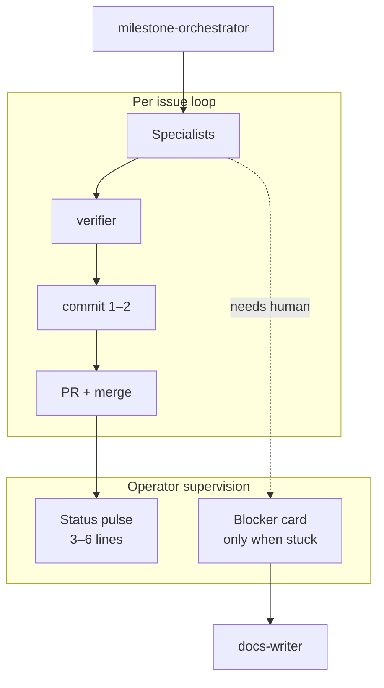
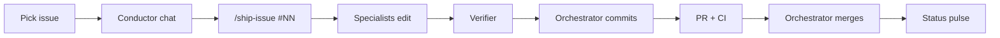

# Agent orchestration playbook

## Background

How this repo uses Cursor **rules**, **subagents**, and **slash commands** to deliver milestones with clean one-issue-one-PR history.

**Operator guide:** [docs/operators/PROJECT-DIRECTION.md](docs/operators/PROJECT-DIRECTION.md) · **Roadmap:** [docs/operators/ROADMAP.md](docs/operators/ROADMAP.md) · **Docs index:** [docs/README.md](docs/README.md)

> **Takeaway:** One issue, one PR. Specialists edit; the orchestrator commits, merges, and keeps you in the loop with short pulses.

---

## 🗺️ Milestone recap

| Milestone | Goal | Status |
|-----------|------|--------|
| **M7** | Reference deployment (Docker, Compose, Caddy, live pilot) | ✅ Shipped |
| **M7.8** | Demo-ready tier: swappable LLM, Anthropic path, streaming | 🚧 Next (#53–#57) |
| **Video / packaging** | Walkthrough linked from README; calm product framing | After M7.8 |
| **M8** | Thin FastAPI `/health`, `/chat`, OpenAPI | After packaging (#58–#60) |
| **M8.5** | Eval report export | Optional (#61) |
| **M9–M11** | Persist, access control, ops runbook | Client-triggered |
| **M12** | Light services / tiers one-pager | Light |

**North star:** private document Q&A with cited answers. Support MVP / n8n CRM is a **separate** later project.

Full detail: [docs/operators/ROADMAP.md](docs/operators/ROADMAP.md).

---

## 🎯 Current focus

- **Ship next:** M7.8 (#53–#57) → demo video → packaging → thin M8 (#58–#60).
- **Then pause** this repo for the Support MVP sibling unless a paid engagement needs more depth here.
- **Later / on demand:** M8.5, M9–M11.

### Delivery train (default queue)

```text
#53 → #54 → (#55 ∥ #56) → #57 → packaging → #58 → #59 → #60 → [pause]
```

| Wave | Work | Agents | Human? |
|------|------|--------|--------|
| 1 | **#53** LLMProvider + env | rag-core → config-guardian → verifier | Only if design ambiguous |
| 2 | **#54** Anthropic adapter | rag-core → config-guardian → verifier | Secrets on VPS/local only |
| 3a ∥ 3b | **#55** streaming · **#56** docs | streamlit (+ rag review) ∥ docs-writer | None if files stay split |
| 4 | **#57** demo video + README | docs-writer prepares; **human records** | **Hard gate:** video URL |
| 5 | **Packaging** | docs-writer | Soft: thumbnail / links OK |
| 6–8 | **#58 → #59 → #60** thin M8 | rag-core → config → streamlit → verifier | Rare |
| — | **Pause** | orchestrator “phase complete” pulse | Support MVP elsewhere |

---

## 👥 Agent roster

| Role (`name`) | Milestones | Owns | Must NOT touch |
|---------------|------------|------|----------------|
| `milestone-orchestrator` | All | Queue, branches, commits, PRs, **merges**, pulses | Direct app code edits |
| `deploy-engineer` | M7, M11 | `Dockerfile`, `docker-compose*.yml`, `Caddyfile`, `deploy/` | `src/app.py`, `src/rag.py` |
| `config-guardian` | M7–M12 | `configs/**`, `.env.example` | Application logic |
| `rag-core-engineer` | M7.8, M8, M9, M12 | `src/rag.py`, `src/rag/**`, `src/api/**` | Streamlit UI, Docker |
| `streamlit-engineer` | Feature UI wiring | `src/app.py` session/chat/upload wiring | Docker, FastAPI internals, visual redesigns |
| `streamlit-ux-designer` | M7.9 UI polish | Layout, IA, microcopy, chat/sources readability | Docker, FastAPI, RAG providers |
| `docs-writer` | M7, M7.8, M10–M12 | `docs/**`, `DEPLOYMENT*.md`, **README**, PR/issue prose, **blocker card polish** | Python except docstrings |
| `verifier` | All | Runs pytest/ruff; `tests/**` fixes only | Feature implementation |
| `blocker-reporter` | All | Blocker summaries (structured) | Code changes |

Invoke by role name. Files live in `.cursor/agents/`.

**Train roster:** orchestrator always on; rag-core on #53/#54/#58/#59; config on #53/#54/#59; streamlit on #55/#60; **streamlit-ux-designer on M7.9**; docs-writer on #56/#57/packaging + pulses/blockers; verifier every issue; deploy-engineer idle unless compose/env deploy notes change.

---

## 🗺️ Issue → agent mapping

### M7 ✅ shipped (#33–#39)

| Issue | Primary | Status |
|-------|---------|--------|
| #33–#39 | see git history | Done. Live at ai-doc-pilot.roxanatapia.dev |

### M7.8: Demo-ready tier (ship first)

| Issue | Primary | Secondary | Est. commits | Serial |
|-------|---------|-----------|--------------|--------|
| #53 M7.8-1 LLMProvider + env | rag-core-engineer | config-guardian | 2–3 | - |
| #54 M7.8-2 Anthropic adapter | rag-core-engineer | config-guardian | 2 | after #53 |
| #55 M7.8-3 Streamlit streaming | streamlit-engineer | rag-core-engineer (review) | 1–2 | after #54 |
| #56 M7.8-4 docs + sample doc | docs-writer | - | 1–2 | parallel #55 |
| #57 M7.8-5 demo video + README | docs-writer | human records | 1 | after #54–#56 |

### M7.9: Interface polish (short UX pass)

| Issue | Primary | Secondary | Est. commits | Serial |
|-------|---------|-----------|--------------|--------|
| M7.9-1 visual foundation | streamlit-ux-designer | - | 1–2 | - |
| M7.9-2 copy + empty/ready states | streamlit-ux-designer | docs-writer (tone) | 1 | after M7.9-1 |
| M7.9-3 sidebar IA | streamlit-ux-designer | - | 1 | after M7.9-2 |
| M7.9-4 chat + Sources readability | streamlit-ux-designer | streamlit-engineer (edge) | 1–2 | after M7.9-3 |

### M8: Thin FastAPI contract (after video + packaging)

| Issue | Primary | Secondary | Est. commits | Serial |
|-------|---------|-----------|--------------|--------|
| #58 M8-1 extract `src/rag/` | rag-core-engineer | verifier | 2–4 | - |
| #59 M8-2 FastAPI `/health` `/chat` | rag-core-engineer | config-guardian | 2–3 | after #58 |
| #60 M8-3 Streamlit → API | streamlit-engineer | rag-core-engineer | 2 | after #59 |

### M8.5: Eval export (optional / next)

| Issue | Primary | Secondary | Est. commits |
|-------|---------|-----------|--------------|
| #61 M8.5-1 eval report export | rag-core-engineer | verifier | 2 |

---

## 🔀 Parallel vs serial

**Safe in parallel:** #56 docs-writer while #55 streamlit (different files).

**Must be serial:** #53 → #54 → #55 (`src/rag.py`, `src/app.py`); #58 → #59 → #60; verifier last before PR.

**Do not parallelize** two agents on `src/rag.py`, `src/app.py`, or `README.md` in one issue.

Only **milestone-orchestrator** runs `git commit`, push, and merge.

---

## 🚂 Train mode (low-touch orchestration)

Default for the delivery train: one conductor chat can run the full queue. Still **one issue = one branch = one PR**. Learning pass is optional and does **not** gate the next issue.



### Per-issue loop

1. Mark issue **In progress**; branch `feat/m7-8-<name>` or `feat/m8-<name>` from latest `main`.
2. Dispatch specialists by ownership (no same-file parallel).
3. Run **verifier** (`pytest`; docker build only if Dockerfile/compose changed).
4. Orchestrator commits (1–2 granular), pushes, opens PR with **`## Main contribution`** first, `Closes #NN`.
5. When CI is green and the issue checklist is met, **orchestrator merges**, then emits a **status pulse** and starts the next wave.

### Commit / push / merge policy (train mode)

| Action | Who | When |
|--------|-----|------|
| Edit code/docs | Specialists | Per issue ownership |
| `git commit` | Orchestrator only | After verifier green |
| Push + open PR | Orchestrator | After commits |
| Merge | Orchestrator | CI green + DoD checklist met |
| Learning pass | Human (optional, async) | Does not block next issue |

If the operator says **hold merges** or **propose only**, fall back to draft PR + wait for explicit `commit` / `push` / `merge`.

### Status pulse (after every merge or wave)

Keep it short. Operator supervises via these, not via “say commit.”

```markdown
## Pulse · #NN merged
- Done: <one outcome line>
- PR: #<pr> → closes #NN
- Next: <next issue or parallel pair>
- Need from you: nothing | see Blocker
```

### Hard human gates (stop the train)

1. **#57 recording** — agents prepare script/README; only the human can film/upload and supply the public URL.
2. **Secrets** — API keys and real hostnames stay in `.env` / VPS only; never in git.
3. **CI still red** after one focused fix attempt — emit a Blocker card; do not loop forever.

Soft gate: packaging thumbnail / README emphasis (default: calm product framing; human can tweak later).

---

## 🐙 GitHub workflow (single issue)



1. Pick issue → **In progress** on Project board.
2. Conductor chat → `/ship-issue #NN` (or continue train chat).
3. Branch: `feat/m7-8-<short-name>` (or `feat/m8-<short-name>`).
4. Specialists edit; orchestrator splits **1–2 granular commits**.
5. `verifier` before PR.
6. PR: **`## Main contribution`** first, `Closes #NN`. Push and merge when green (train mode).
7. Optional learning pass later (see PROJECT-DIRECTION).

For the full queue, prefer `/ship-milestone M7.8` then continue into packaging + thin M8 rather than a fresh chat per issue (unless context is huge).

---

## ⌨️ Slash commands

| Command | Purpose |
|---------|---------|
| `/ship-issue` | Ship one GitHub issue end-to-end (**use this**) |
| `/ship-m7-issue` | Alias → same as `/ship-issue` |
| `/ship-milestone` | Run or plan a milestone train (M7.8–M12) |
| `/verify` | pytest + ruff; report gaps |

---

## 🧾 Human decisions log

| Decision | Current default | Notes |
|----------|-----------------|-------|
| VPS provider | Hetzner CPX32 (~€15/mo) | Falkenstein |
| Demo / video LLM | **Anthropic Haiku** (`LLM_PROVIDER=anthropic`) | Fast recording; API key in `.env` only |
| Self-host / air-gap LLM | Ollama (`phi3:mini` CPU; `llama3.1:8b` if RAM allows) | Not for walkthrough video |
| Domain / HTTPS | ai-doc-pilot.roxanatapia.dev | M7-6 done |
| Pitch vertical | **Confidential documents** (not legal-only) | NDA = eval corpus |
| Commit / merge policy | **Train mode:** orchestrator commits, pushes, merges when verifier + CI green | Operator may say `hold merges` for propose-only |
| Private deploy repo | Deferred until M10 or first client | App stays public |
| OpenAI provider | After Anthropic (#54) | Optional third backend |
| Support MVP / n8n CRM bot | Separate later project | Not this repo’s M8+ north star |
| M9–M11 depth | Client-triggered | Not required for demo-ready pause |
| Thin M8 in delivery train | **Include** (#58–#60 after packaging) | Then pause for Support MVP |

---

## 🚧 Blocker template

When stuck, invoke **blocker-reporter**, then ask **docs-writer** to polish into a clear “need you” card. **STOP** the train until the human replies (or the default timeout applies).

```markdown
## Blocker · need you
- **Issue:** #NN
- **What I need:** (concrete ask, e.g. YouTube/Loom URL)
- **Why:** (what cannot ship without it)
- **What is ready:** (what agents already finished)
- **Options:** A / B with tradeoff (optional)
- **Default if no reply:** (from Human decisions log; include quiet period if useful)
- **Blocks:** list of files/issues
- **Reply with:** (exact shape of answer you need)
```

---

## 📚 Documentation maintenance

| File | Owner | Update when |
|------|-------|-------------|
| **README.md** | `docs-writer` | Phase changes; video link (client-facing) |
| **DEPLOYMENT.md** | `docs-writer` + `deploy-engineer` | LLM provider setup, Compose |
| **docs/operators/ROADMAP.md** | `docs-writer` | Milestone scope changes |
| **docs/operators/PROJECT-DIRECTION.md** | Human + orchestrator | Phase order, operator habits |
| **docs/README.md** | `docs-writer` | Docs structure / index |
| **PR / issue prose** | `docs-writer` | Short warm Main contribution; issue Outcome + DoD |
| **Blocker cards** | `blocker-reporter` + `docs-writer` polish | Human gates |
| **AGENTS.md** | Human + orchestrator | Train policy, issues, decision log |

Tone for operator docs and GitHub issues: calm and confident. Avoid “hire-me,” “Upwork niche,” or salesy framing. Client contact links in README are fine; milestone prose is not a pitch deck.

After each phase slice: dispatch `docs-writer` to sync README + ROADMAP. Before opening a PR, docs-writer may polish the PR body (and issue text when needed).

---

## 📋 Operator prompts

### Full delivery train (preferred)

```text
Act as milestone-orchestrator. Run the delivery train:
#53 → #54 → (#55 ∥ #56) → #57 → packaging → #58 → #59 → #60.

- Follow docs/operators/PROJECT-DIRECTION.md, docs/operators/ROADMAP.md, and AGENTS.md
- Specialists must NOT commit; you commit, push, and merge when verifier + CI are green
- After each merge, send a short Status pulse
- On hard gates (#57 video URL, secrets, CI still red): Blocker card (docs-writer polish) and STOP
- Do not start Support MVP in this repo; end with a phase-complete pulse
```

### Single issue (propose-only / hold merges)

```text
Act as milestone-orchestrator. Ship GitHub issue #NN. Hold merges.

- New branch from main: feat/<phase>-<short-name>
- Follow docs/operators/PROJECT-DIRECTION.md and docs/operators/ROADMAP.md
- Specialists must NOT commit; you split 1–2 granular commits
- Run verifier before PR
- Draft PR with Main contribution; wait for my commit / push / merge
- If blocker: invoke blocker-reporter + docs-writer polish and STOP
```
