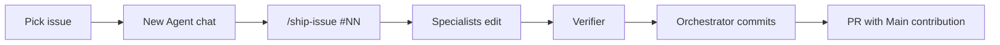

# Agent orchestration playbook

## Background

How this repo uses Cursor **rules**, **subagents**, and **slash commands** to deliver milestones with clean one-issue-one-PR history.

**Operator guide:** [docs/operators/PROJECT-DIRECTION.md](docs/operators/PROJECT-DIRECTION.md) · **Roadmap:** [docs/operators/ROADMAP.md](docs/operators/ROADMAP.md) · **Docs index:** [docs/README.md](docs/README.md)

> **Takeaway:** One issue, one chat, one PR. Specialists edit; only the orchestrator commits.

---

## 🎯 Current focus

- **Ship first:** M7.8 (#53–#57) → demo video → portfolio packaging (see ROADMAP).
- **Then pause** for Support MVP (sibling project). **Optional:** thin M8 if jobs ask for FastAPI. **Client-triggered later:** M8.5, M9–M11.
- **North star:** private document Q&A (this repo). n8n CRM / website Support MVP = **separate later project**, not M8+ here.

---

## 👥 Agent roster

| Role (`name`) | Milestones | Owns | Must NOT touch |
|---------------|------------|------|----------------|
| `milestone-orchestrator` | All | Reads issues, branches, PR plan | Direct code edits |
| `deploy-engineer` | M7, M11 | `Dockerfile`, `docker-compose*.yml`, `Caddyfile`, `deploy/` | `src/app.py`, `src/rag.py` |
| `config-guardian` | M7–M12 | `configs/**`, `.env.example` | Application logic |
| `rag-core-engineer` | M7.8, M8, M9, M12 | `src/rag.py`, `src/rag/**`, `src/api/**` | Streamlit UI, Docker |
| `streamlit-engineer` | All UI | `src/app.py` | Docker, FastAPI internals |
| `docs-writer` | M7, M7.8, M10–M12 | `docs/**`, `DEPLOYMENT*.md`, **README** | Python except docstrings |
| `verifier` | All | Runs pytest/ruff; `tests/**` fixes only | Feature implementation |
| `blocker-reporter` | All | Blocker summaries | Code changes |

Invoke by role name. Files live in `.cursor/agents/`.

---

## 🗺️ Issue → agent mapping

### M7 ✅ shipped (#33–#39)

| Issue | Primary | Status |
|-------|---------|--------|
| #33–#39 | see git history | Done. Live at ai-doc-pilot.roxanatapia.dev |

### M7.8: Demo-ready tier (ship first)

| Issue | Primary | Secondary | Est. commits | Serial |
|-------|---------|-----------|--------------|--------|
| #53 M7.8-1 LLMProvider + env | rag-core-engineer | config-guardian | 2–3 | - |
| #54 M7.8-2 Anthropic adapter | rag-core-engineer | config-guardian | 2 | after #53 |
| #55 M7.8-3 Streamlit streaming | streamlit-engineer | rag-core-engineer (review) | 1–2 | after #54 |
| #56 M7.8-4 docs + sample doc | docs-writer | - | 1–2 | parallel #55 |
| #57 M7.8-5 demo video + README | docs-writer | human records | 1 | after #54–#56 |

### M8: Thin FastAPI market contract (after video + packaging)

| Issue | Primary | Secondary | Est. commits | Serial |
|-------|---------|-----------|--------------|--------|
| #58 M8-1 extract `src/rag/` | rag-core-engineer | verifier | 2–4 | - |
| #59 M8-2 FastAPI `/health` `/chat` | rag-core-engineer | config-guardian | 2–3 | after #58 |
| #60 M8-3 Streamlit → API | streamlit-engineer | rag-core-engineer | 2 | after #59 |

### M8.5: Eval export (optional / next)

| Issue | Primary | Secondary | Est. commits |
|-------|---------|-----------|--------------|
| #61 M8.5-1 eval report export | rag-core-engineer | verifier | 2 |

---

## 🔀 Parallel vs serial

**Safe in parallel:** #56 docs-writer while #55 streamlit (different files).

**Must be serial:** #53 → #54 → #55 (`src/rag.py`, `src/app.py`); #58 → #59 → #60; verifier last before PR.

**Do not parallelize** two agents on `src/rag.py`, `src/app.py`, or `README.md` in one issue.

Only **milestone-orchestrator** runs `git commit`.

---

## 🐙 GitHub workflow



1. Pick issue → **In progress** on Project board.
2. **New Agent chat** → `/ship-issue #NN`.
3. Branch: `feat/m7-8-<short-name>` (or `feat/m8-<short-name>`).
4. Specialists edit; orchestrator splits **1–2 granular commits**.
5. `verifier` before PR.
6. PR: **`## Main contribution`** first, `Closes #NN`. Push/merge when human approves.
7. **15 min learning pass** (see PROJECT-DIRECTION).

---

## ⌨️ Slash commands

| Command | Purpose |
|---------|---------|
| `/ship-issue` | Ship one GitHub issue end-to-end (**use this**) |
| `/ship-m7-issue` | Alias → same as `/ship-issue` |
| `/ship-milestone` | Plan or status for M7.8–M12 |
| `/verify` | pytest + ruff; report gaps |

---

## 🧾 Human decisions log

| Decision | Current default | Notes |
|----------|-----------------|-------|
| VPS provider | Hetzner CPX32 (~€15/mo) | Falkenstein |
| Demo / video LLM | **Anthropic Haiku** (`LLM_PROVIDER=anthropic`) | Fast recording; API key in `.env` only |
| Self-host / air-gap LLM | Ollama (`phi3:mini` CPU; `llama3.1:8b` if RAM allows) | Not for YouTube hero |
| Domain / HTTPS | ai-doc-pilot.roxanatapia.dev | M7-6 done |
| Pitch vertical | **Confidential documents** (not legal-only) | NDA = eval corpus |
| Commit policy | Orchestrator proposes; human says `commit` | No push without approval |
| Private deploy repo | Deferred until M10 or first client | App stays public |
| OpenAI provider | After Anthropic (#54) | Optional third backend |
| Support MVP / n8n CRM bot | Separate later project | Not this repo’s M8+ north star |
| M9–M11 depth | Client-triggered | Not required for portfolio readiness |

---

## 🚧 Blocker template

```markdown
## Blocker
- **Issue:** #NN
- **Decision needed:** (e.g. Anthropic model id, streaming UX)
- **Options:** A / B with tradeoff
- **Default if no reply:** (from Human decisions log)
- **Blocks:** list of files/issues
```

---

## 📚 Documentation maintenance

| File | Owner | Update when |
|------|-------|-------------|
| **README.md** | `docs-writer` | Phase changes; video link (client-facing) |
| **DEPLOYMENT.md** | `docs-writer` + `deploy-engineer` | LLM provider setup, Compose |
| **docs/operators/ROADMAP.md** | `docs-writer` | Milestone scope changes |
| **docs/operators/PROJECT-DIRECTION.md** | Human + orchestrator | Phase order, operator habits |
| **docs/README.md** | `docs-writer` | Docs structure / index |
| **AGENTS.md** | Human + orchestrator | New issues, decision log |

After each phase slice: dispatch `docs-writer` to sync README + ROADMAP.

---

## 📋 Operator prompt (copy per issue)

```text
Act as milestone-orchestrator. Ship GitHub issue #NN.

- New branch from main: feat/<phase>-<short-name>
- Follow docs/operators/PROJECT-DIRECTION.md and docs/operators/ROADMAP.md
- Specialists must NOT commit; you split 1–2 granular commits
- Run verifier before PR
- After merge I will read the diff myself (learning pass)
- If blocker: invoke blocker-reporter and STOP
- Do not push unless I say push
```
