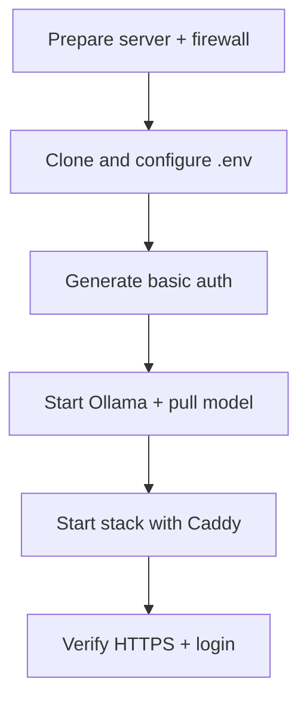

# Deployment Guide

## Background

For IT buyers and operators standing up a single-VM pilot: Docker Compose + Ollama on a VPS or your laptop. No source-code changes required.

Architecture diagram: [docs/product/architecture.md](docs/product/architecture.md)

> **Takeaway:** Two LLM tiers, one Compose app: **self-host** (Ollama, private / air-gap) and **demo** (Anthropic Haiku, low latency for recording). Start Ollama first for the default path, then bring up the app (and Caddy for HTTPS).

---

## ✅ Prerequisites

| Requirement | Notes |
|-------------|-------|
| **Docker 24+** | BuildKit enabled (`DOCKER_BUILDKIT=1`) |
| **Docker Compose v2** | `docker compose` plugin, not legacy `docker-compose` |
| **git** | To clone the repo |
| **~4 GB free disk** | App image + Ollama model weights |
| **SSH access** | For VPS deployment |
| **Outbound internet** | First run downloads embedding weights and Ollama model blobs |

---

## 💻 VPS sizing

| Profile | Hardware | Model | Use | Cost |
|---------|----------|-------|-----|------|
| **CPU pilot** | 4 vCPU / 8 GB RAM (e.g. Hetzner CPX32) | `phi3:mini` | Evaluations, demos | ~€15/mo |
| **GPU** | 8 GB+ VRAM | `llama3.1:8b` | Better quality, faster inference | ~$50–200+/mo |

- **`phi3:mini`:** fits comfortably on 8 GB; first answer cold-starts in 30–60 s. Set `OLLAMA_NUM_CTX=1024` or `2048` in `.env` to avoid OOM.
- **`llama3.1:8b`:** noticeably better answers; needs GPU or large-RAM host. On CPU-only 8 GB you will likely hit OOM.

Model weights persist in the `ollama_models` Docker volume across restarts.

> **Deploy ≠ demo.** CPU Ollama is fine for private evaluation. For a polished walkthrough video, use the [Anthropic demo tier](#anthropic-demo-tier). Do not expect YouTube-smooth latency from `phi3:mini` on a small VPS.

---

## 🚀 Deploy on a VPS (recommended path)



### 1. Prepare the server

```bash
sudo apt-get update && sudo apt-get install -y git ca-certificates curl
# Install Docker 24+ per https://docs.docker.com/engine/install/
sudo usermod -aG docker "$USER"   # log out and back in after this
```

**Firewall:** open only what Caddy needs; keep Streamlit and Ollama internal:

```bash
sudo ufw allow OpenSSH
sudo ufw allow 80/tcp
sudo ufw allow 443/tcp
sudo ufw enable
```

### 2. Clone and configure

```bash
git clone https://github.com/RoxanaTapia/ai-doc-to-chat-pipeline.git
cd ai-doc-to-chat-pipeline
cp .env.example .env
nano .env
```

Minimum `.env` for a CPU host with a domain and HTTPS:

```bash
OLLAMA_MODEL=phi3:mini
OLLAMA_NUM_CTX=1024
APP_PRESENTATION_MODE=client
APP_ALLOW_DEV_TOGGLE=false
SITE_ADDRESS=your-subdomain.example.com
ACME_EMAIL=you@example.com
```

For an **IP-only interim** (no domain yet), set `CADDYFILE=./Caddyfile.ip` instead of `SITE_ADDRESS` (path is relative to `deploy/` when Compose resolves volumes).

### 3. Generate basic-auth credentials

```bash
chmod +x deploy/generate-caddy-auth.sh
./deploy/generate-caddy-auth.sh demo 'YOUR_STRONG_PASSWORD'
```

Writes `deploy/caddy-basicauth.conf` (gitignored). Re-run to change the password.

For **IP-only** mode, also generate a self-signed TLS cert:

```bash
chmod +x deploy/generate-ip-tls.sh
./deploy/generate-ip-tls.sh YOUR_VPS_IP
```

### 4. Start Ollama and pull a model

```bash
docker compose -f deploy/docker-compose.yml up -d ollama
docker compose -f deploy/docker-compose.yml ps ollama          # wait for STATUS = healthy (~60 s)
docker compose -f deploy/docker-compose.yml exec ollama ollama pull phi3:mini
```

### 5. Start the full stack with HTTPS

From the **repo root** (so `.env` is found and volume names stay stable):

```bash
docker compose --env-file .env -p ai-doc-to-chat-pipeline \
  -f deploy/docker-compose.yml -f deploy/docker-compose.caddy.yml up --build -d
docker compose --env-file .env -p ai-doc-to-chat-pipeline \
  -f deploy/docker-compose.yml -f deploy/docker-compose.caddy.yml ps
```

Expect: `ollama` **healthy** · `app` **Up** · `caddy` **Up**. Port 8501 is not exposed publicly.

Set `COMPOSE_PROJECT_NAME=ai-doc-to-chat-pipeline` in `.env` (see `.env.example`) so you can omit `-p` later. Always pass `--env-file .env` when the first compose file lives under `deploy/`.

### 6. Verify

### Time-limited invites

Set `INVITE_SECRET` in `.env` (required for the Caddy overlay). Mint out-of-band codes:

```bash
python deploy/invite/mint.py --ttl 72h --label client-acme
```

Invitees redeem via the gate (**Have invite**) or the signed URL (`/invite/redeem?token=…`). Valid cookie bypasses basic auth on `/app`; operators still use basic auth as fallback. Details: [deploy/invite/README.md](deploy/invite/README.md).

With the hybrid Caddyfile (public gate + app under `/app`):

```bash
# Public gate (no credentials): expect 200 HTML from roxanatapia-web sites/pilot-gate
curl -sk -o /dev/null -w "%{http_code}\n" https://YOUR_DOMAIN/

# App path: 401 without credentials, 200 with
curl -sk -o /dev/null -w "%{http_code}\n" https://YOUR_DOMAIN/app
curl -sk -o /dev/null -w "%{http_code}\n" -u demo:YOUR_PASSWORD https://YOUR_DOMAIN/app
```

Open `https://YOUR_DOMAIN/` for the gate, then **Sign in** → `/app`. Upload a PDF, ask a question.

**Apex landing** (`roxanatapia.dev`) is served from the same Caddy process via static files under `/srv/roxanatapia-web/sites/apex`. Marketing sites and cutover steps: [roxanatapia-web deploy/CUTOVER.md](https://github.com/RoxanaTapia/roxanatapia-web/blob/main/deploy/CUTOVER.md). Deploy those files on the VPS before reloading Caddy.

**IP-only mode** (`Caddyfile.ip`) still puts basic auth on the whole listener (no static gate). Use domain mode for the hybrid front door.

**Later, switch from IP to domain:** set `SITE_ADDRESS=your.domain.com` + `ACME_EMAIL`, remove `CADDYFILE=./Caddyfile.ip`, recreate Caddy. Let's Encrypt issues the cert automatically.

---

## 🖥️ Local development

```bash
# Start Ollama
docker compose -f deploy/docker-compose.yml up -d ollama
docker compose -f deploy/docker-compose.yml ps ollama   # wait for healthy

# Pull a model once
docker compose -f deploy/docker-compose.yml exec ollama ollama pull phi3:mini

# Build and start app
docker compose -f deploy/docker-compose.yml up --build -d
```

Open [http://localhost:8501](http://localhost:8501). Port 8501 binds to the host in the default (non-Caddy) Compose config.

### Thin API (optional)

Same Docker image; OpenAPI at `/docs`. Pass retrieved `context` with each `POST /chat` (no document store yet).

```bash
# Local (repo root, venv active)
PYTHONPATH=src uvicorn api.app:app --host 127.0.0.1 --port 8000

# Compose profile
docker compose -f deploy/docker-compose.yml --profile api up --build -d api
curl -s http://localhost:8000/health
```

Streamlit stays in-process by default. To route generation through the API, set `API_BASE_URL` (e.g. `http://127.0.0.1:8000` locally, or `http://api:8000` between Compose services).

For Caddy locally: same `--env-file .env -p ai-doc-to-chat-pipeline -f deploy/…` flow with `CADDYFILE=./Caddyfile.ip` and a self-signed cert.

---

## ⚙️ Environment variables

Settings cascade: `.env` overrides → `configs/config.yaml` → built-in defaults.

| Variable | Default | Purpose |
|----------|---------|---------|
| `OLLAMA_HOST` | `http://ollama:11434` | Ollama URL inside Compose network |
| `OLLAMA_MODEL` | `llama3.1:8b` | Override with `phi3:mini` for CPU hosts |
| `OLLAMA_NUM_CTX` | `4096` (yaml) | Reduce to `1024` or `2048` on 8 GB RAM |
| `USE_DUMMY_GENERATOR` | `false` | Must be `false` for real answers |
| `APP_PRESENTATION_MODE` | `client` | `client` hides dev debug panels |
| `APP_ALLOW_DEV_TOGGLE` | `false` | `true` only for local retrieval tuning |
| `SITE_ADDRESS` | *(empty)* | Subdomain for Let's Encrypt (e.g. `demo.example.com`) |
| `COMPOSE_PROJECT_NAME` | `ai-doc-to-chat-pipeline` | Keeps Docker volume names stable after the `deploy/` layout move |
| `ACME_EMAIL` | *(empty)* | Optional ACME contact; not required for existing certs |
| `CADDYFILE` | `./Caddyfile` | Set to `./Caddyfile.ip` for bare-IP mode; relative to `deploy/` |
| `LLM_PROVIDER` | *(empty → ollama)* | Set to `anthropic` for the fast demo tier |
| `ANTHROPIC_API_KEY` | *(empty)* | Required when `LLM_PROVIDER=anthropic`; `.env` only, never git |
| `ANTHROPIC_MODEL` | `claude-haiku-4-5-20251001` | Optional Haiku override |

Full list: [`.env.example`](.env.example)

---

## ⚡ Demo tier vs self-host tier

Same app and embeddings; only the answer-generation backend changes.

| Tier | Env | Best for | Honest limit |
|------|-----|----------|--------------|
| **Self-host** | `LLM_PROVIDER` unset or `ollama` | Private pilots, air-gap, documents stay on your VM | CPU Ollama can take tens of seconds per answer |
| **Demo** | `LLM_PROVIDER=anthropic` + API key in `.env` | Walkthrough recording, snappy demos | Generation uses Anthropic; do not treat this as air-gap |

Walkthrough storyboard: [docs/product/demo-script.md](docs/product/demo-script.md). Record with the demo tier; show the Ollama architecture for self-host.

### Anthropic demo tier

In `.env` only (never commit keys):

```bash
LLM_PROVIDER=anthropic
ANTHROPIC_API_KEY=your-key-here
# Optional; default is Claude Haiku
# ANTHROPIC_MODEL=claude-haiku-4-5-20251001
```

Restart the app container after changing provider or key. Leave `LLM_PROVIDER` unset (or `ollama`) for the Compose + Ollama flow above.

---

## 🔧 Troubleshooting

| Symptom | Likely cause | Fix |
|---------|-------------|-----|
| `app` never starts | Ollama not healthy yet | `docker compose -f deploy/docker-compose.yml logs ollama` (wait for `healthy`) |
| Connection refused on Ollama | Wrong host or app started too early | Use Compose; `OLLAMA_HOST` must be `http://ollama:11434`, not `localhost` |
| `YOUR_VPS_IP:8501` accessible from internet | Caddy overlay not active | Use `-f deploy/docker-compose.caddy.yml`; confirm `caddy` is Up |
| **401** with correct password | Wrong hash in conf file | Re-run `./deploy/generate-caddy-auth.sh`, restart Caddy |
| **401** on `/app` without password | Expected | Public gate is `/`; only `/app` requires basic auth |
| Caddy restart loop: `email` parse error | Empty `ACME_EMAIL` inside container, or `{$VAR:you@…}` default | Pass `--env-file .env`; do not use an `@` in Caddy env defaults |
| Caddy: `caddy-basicauth.conf: is a directory` | Docker created an empty host dir after a bad bind path | `rm -rf` that directory; mount `deploy/caddy-basicauth.conf` (a file); recreate Caddy |
| New volumes named `deploy_*` | Project name became `deploy` | Use `-p ai-doc-to-chat-pipeline` or `COMPOSE_PROJECT_NAME` |
| `SITE_ADDRESS` / `ACME_EMAIL` empty in `docker inspect` | Root `.env` not loaded | Always `docker compose --env-file .env …` from repo root |
| **ERR_SSL_PROTOCOL_ERROR** / TLS error | Stale or mismatched cert/key | Re-run `./deploy/generate-ip-tls.sh YOUR_IP`, wipe Caddy volumes, recreate |
| **Model not found** in chat | Model not pulled or name mismatch | `docker compose -f deploy/docker-compose.yml exec ollama ollama pull phi3:mini`; set `OLLAMA_MODEL` to same tag |
| OOM / very slow on CPU | Model too large for RAM | Use `phi3:mini`; set `OLLAMA_NUM_CTX=1024` in `.env` |
| Slow first answer | Cold model start | Normal on first query; later answers are faster |
| Disk full during pull | ~4 GB needed | `docker system df`; prune unused images |

Quick diagnostics:

```bash
docker compose --env-file .env -p ai-doc-to-chat-pipeline \
  -f deploy/docker-compose.yml -f deploy/docker-compose.caddy.yml ps
docker compose -f deploy/docker-compose.yml logs --tail=50 app
docker compose -f deploy/docker-compose.yml logs --tail=50 ollama
docker compose -f deploy/docker-compose.yml exec ollama ollama list
```
