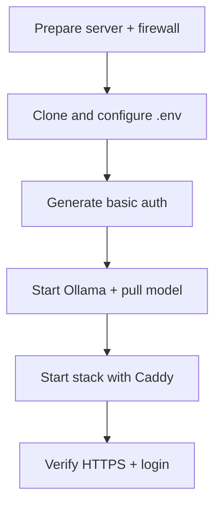

# Deployment Guide

## Background

For IT buyers and operators standing up a single-VM pilot: Docker Compose + Ollama on a VPS or your laptop. No source-code changes required.

Architecture diagram: [docs/product/architecture.md](docs/product/architecture.md)

> **Takeaway:** Start Ollama first, pull a small model on CPU hosts, then bring up the app (and Caddy for HTTPS). Verify with curl before you invite evaluators.

---

## ✅ Prerequisites

| Requirement | Notes |
|-------------|-------|
| **Docker 24+** | BuildKit enabled (`DOCKER_BUILDKIT=1`) |
| **Docker Compose v2** | `docker compose` plugin, not legacy `docker-compose` |
| **git** | To clone the repo |
| **~4 GB free disk** | App image + Ollama model weights |
| **SSH access** | For VPS deployment |
| **Outbound internet** | First run downloads embedding weights and Ollama model blobs |

---

## 💻 VPS sizing

| Profile | Hardware | Model | Use | Cost |
|---------|----------|-------|-----|------|
| **CPU pilot** | 4 vCPU / 8 GB RAM (e.g. Hetzner CPX32) | `phi3:mini` | Evaluations, demos | ~€15/mo |
| **GPU** | 8 GB+ VRAM | `llama3.1:8b` | Better quality, faster inference | ~$50–200+/mo |

- **`phi3:mini`:** fits comfortably on 8 GB; first answer cold-starts in 30–60 s. Set `OLLAMA_NUM_CTX=1024` or `2048` in `.env` to avoid OOM.
- **`llama3.1:8b`:** noticeably better answers; needs GPU or large-RAM host. On CPU-only 8 GB you will likely hit OOM.

Model weights persist in the `ollama_models` Docker volume across restarts.

> **Deploy ≠ demo.** CPU Ollama is fine for private evaluation. For a polished walkthrough video, prefer a faster demo-tier model when available (see operator notes). Do not expect YouTube-smooth latency from `phi3:mini` on a small VPS.

---

## 🚀 Deploy on a VPS (recommended path)



### 1. Prepare the server

```bash
sudo apt-get update && sudo apt-get install -y git ca-certificates curl
# Install Docker 24+ per https://docs.docker.com/engine/install/
sudo usermod -aG docker "$USER"   # log out and back in after this
```

**Firewall:** open only what Caddy needs; keep Streamlit and Ollama internal:

```bash
sudo ufw allow OpenSSH
sudo ufw allow 80/tcp
sudo ufw allow 443/tcp
sudo ufw enable
```

### 2. Clone and configure

```bash
git clone https://github.com/RoxanaTapia/ai-doc-to-chat-pipeline.git
cd ai-doc-to-chat-pipeline
cp .env.example .env
nano .env
```

Minimum `.env` for a CPU host with a domain and HTTPS:

```bash
OLLAMA_MODEL=phi3:mini
OLLAMA_NUM_CTX=1024
APP_PRESENTATION_MODE=client
APP_ALLOW_DEV_TOGGLE=false
SITE_ADDRESS=your-subdomain.example.com
ACME_EMAIL=you@example.com
```

For an **IP-only interim** (no domain yet), set `CADDYFILE=./Caddyfile.ip` instead of `SITE_ADDRESS`.

### 3. Generate basic-auth credentials

```bash
chmod +x deploy/generate-caddy-auth.sh
./deploy/generate-caddy-auth.sh demo 'YOUR_STRONG_PASSWORD'
```

Writes `deploy/caddy-basicauth.conf` (gitignored). Re-run to change the password.

For **IP-only** mode, also generate a self-signed TLS cert:

```bash
chmod +x deploy/generate-ip-tls.sh
./deploy/generate-ip-tls.sh YOUR_VPS_IP
```

### 4. Start Ollama and pull a model

```bash
docker compose up -d ollama
docker compose ps ollama          # wait for STATUS = healthy (~60 s)
docker compose exec ollama ollama pull phi3:mini
```

### 5. Start the full stack with HTTPS

```bash
docker compose -f docker-compose.yml -f docker-compose.caddy.yml up --build -d
docker compose -f docker-compose.yml -f docker-compose.caddy.yml ps
```

Expect: `ollama` **healthy** · `app` **Up** · `caddy` **Up**. Port 8501 is not exposed publicly.

### 6. Verify

```bash
# 401 without credentials, 200 with
curl -sk -o /dev/null -w "%{http_code}\n" https://YOUR_DOMAIN/
curl -sk -o /dev/null -w "%{http_code}\n" -u demo:YOUR_PASSWORD https://YOUR_DOMAIN/
```

Open `https://YOUR_DOMAIN` in a browser. Sign in, upload a PDF, ask a question.

**Later, switch from IP to domain:** set `SITE_ADDRESS=your.domain.com` + `ACME_EMAIL`, remove `CADDYFILE=./Caddyfile.ip`, recreate Caddy. Let's Encrypt issues the cert automatically.

---

## 🖥️ Local development

```bash
# Start Ollama
docker compose up -d ollama
docker compose ps ollama   # wait for healthy

# Pull a model once
docker compose exec ollama ollama pull phi3:mini

# Build and start app
docker compose up --build -d
```

Open [http://localhost:8501](http://localhost:8501). Port 8501 binds to the host in the default (non-Caddy) Compose config.

For Caddy locally: same `docker compose -f docker-compose.yml -f docker-compose.caddy.yml` flow with `CADDYFILE=./Caddyfile.ip` and a self-signed cert.

---

## ⚙️ Environment variables

Settings cascade: `.env` overrides → `configs/config.yaml` → built-in defaults.

| Variable | Default | Purpose |
|----------|---------|---------|
| `OLLAMA_HOST` | `http://ollama:11434` | Ollama URL inside Compose network |
| `OLLAMA_MODEL` | `llama3.1:8b` | Override with `phi3:mini` for CPU hosts |
| `OLLAMA_NUM_CTX` | `4096` (yaml) | Reduce to `1024` or `2048` on 8 GB RAM |
| `USE_DUMMY_GENERATOR` | `false` | Must be `false` for real answers |
| `APP_PRESENTATION_MODE` | `client` | `client` hides dev debug panels |
| `APP_ALLOW_DEV_TOGGLE` | `false` | `true` only for local retrieval tuning |
| `SITE_ADDRESS` | *(empty)* | Subdomain for Let's Encrypt (e.g. `demo.example.com`) |
| `ACME_EMAIL` | *(empty)* | Let's Encrypt registration email |
| `CADDYFILE` | `./Caddyfile` | Set to `./Caddyfile.ip` for bare-IP mode |

Full list: [`.env.example`](.env.example)

---

## 🔧 Troubleshooting

| Symptom | Likely cause | Fix |
|---------|-------------|-----|
| `app` never starts | Ollama not healthy yet | `docker compose logs ollama` (wait for `healthy`) |
| Connection refused on Ollama | Wrong host or app started too early | Use Compose; `OLLAMA_HOST` must be `http://ollama:11434`, not `localhost` |
| `YOUR_VPS_IP:8501` accessible from internet | Caddy overlay not active | Use `-f docker-compose.caddy.yml`; confirm `caddy` is Up |
| **401** with correct password | Wrong hash in conf file | Re-run `./deploy/generate-caddy-auth.sh`, restart Caddy |
| **ERR_SSL_PROTOCOL_ERROR** / TLS error | Stale or mismatched cert/key | Re-run `./deploy/generate-ip-tls.sh YOUR_IP`, wipe Caddy volumes, recreate |
| **Model not found** in chat | Model not pulled or name mismatch | `docker compose exec ollama ollama pull phi3:mini`; set `OLLAMA_MODEL` to same tag |
| OOM / very slow on CPU | Model too large for RAM | Use `phi3:mini`; set `OLLAMA_NUM_CTX=1024` in `.env` |
| Slow first answer | Cold model start | Normal on first query; later answers are faster |
| Disk full during pull | ~4 GB needed | `docker system df`; prune unused images |

Quick diagnostics:

```bash
docker compose ps
docker compose logs --tail=50 app
docker compose logs --tail=50 ollama
docker compose exec ollama ollama list
```
