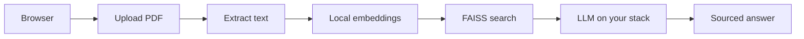

# AI Doc to Chat

> Private, grounded answers from your PDFs, on infrastructure you control.

[Live Pilot](https://ai-doc-pilot.roxanatapia.dev) · [Public Demo](https://ai-doc-to-chat-demo.streamlit.app) · [Deployment Guide](DEPLOYMENT.md) · [Docs](docs/README.md)

Upload a confidential PDF (policies, SOPs, reports, contracts, or internal handbooks), ask questions in plain language, and get sourced answers with page-level citations. Documents stay on **your server**. Local embeddings by default; choose a local LLM for air-gap pilots, or a fast API model for demos.

---

## 🚀 Try it

| | Where | What you get |
|-|--------|--------------|
| **Public demo** | [Streamlit Cloud](https://ai-doc-to-chat-demo.streamlit.app) | UI walkthrough (no login, no LLM) |
| **Live pilot** | [ai-doc-pilot.roxanatapia.dev](https://ai-doc-pilot.roxanatapia.dev) | Real answers, HTTPS, password-protected |
| **Your deployment** | Your VPS or cloud | Full private stack under your control |

The live pilot is password-protected. Credentials are not published here.
[Request access on Upwork](https://www.upwork.com/freelancers/roxanadev) for a walkthrough, or once you have access use the [sample NDA](docs/product/sample-nda.pdf) or the [sample retention policy](docs/product/sample-policy.md) (export the markdown to PDF).

**Demo video:** Coming after the demo-ready recording pass. Storyboard: [docs/product/demo-script.md](docs/product/demo-script.md).

> **Privacy note:** Uploaded files are processed in memory and never stored. Each session starts fresh. Use only sample or non-confidential documents on the shared pilot. For sensitive documents, [deploy your own instance](DEPLOYMENT.md).

---

## 🔄 How it works

Everything runs on one VM. Your documents never leave your environment (self-host tier), or you can use a fast demo-tier LLM when latency matters. Details: [DEPLOYMENT.md](DEPLOYMENT.md) · [Architecture](docs/product/architecture.md).

---

## ✨ What it does well

- **Policies, SOPs, reports, contracts, handbooks:** find rules, obligations, dates, and definitions in the PDF you uploaded
- **Sourced answers:** every response cites the page and excerpt it used
- **Private by design:** local embeddings; local LLM for air-gap, or a swappable API model for demos
- **Auditable:** Docker Compose stack your IT team can review and reproduce

## ⚠️ Known limits (evaluation pilot)

- **Session-based:** re-upload after restart; no shared document library yet
- **Read, don't calculate:** finds printed numbers; does not sum or verify math
- **Single document per session:** not enterprise search across file stores
- **Document Q&A, not a support bot:** answers questions about the uploaded PDF; does not integrate with CRM, email, or ticketing

---

## 🤝 For teams evaluating a private stack

> Teams that cannot paste confidential PDFs into a public chatbot need a stack they can run, audit, and own. That is the aim here.

Typical path: pilot on a modest VM → validate answers on your own sample documents → harden for production with your IT team (auth, persistence, runbooks) when you are ready.

**Get in touch:** [Upwork](https://www.upwork.com/freelancers/roxanadev) · [GitHub](https://github.com/RoxanaTapia)

---

## 🛠️ Self-host

Follow the [Deployment Guide](DEPLOYMENT.md). It covers VPS sizing, HTTPS with Caddy, basic auth, the Anthropic **demo tier**, and the Ollama **self-host tier**.

Eval corpus: [sample NDA](docs/product/sample-nda.pdf) · [sample retention policy](docs/product/sample-policy.md) · [pilot evaluation](docs/product/pilot-evaluation.md).

**What's next on this product:** demo-ready recording and a calm walkthrough video. Deeper production (persistence, SSO, ops) lands when a pilot needs it. Full sequencing for contributors: [docs/operators/ROADMAP.md](docs/operators/ROADMAP.md).

---

## Stack

Streamlit · LangChain · FAISS · sentence-transformers · PyMuPDF · Tesseract · Ollama · Docker

MIT licensed · Made by [Roxana Tapia](https://github.com/RoxanaTapia) · 2026
