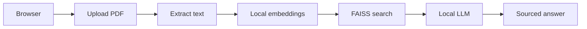

# AI Doc to Chat

> Private, grounded answers from your PDFs, on infrastructure you control.

[Live Pilot](https://ai-doc-pilot.roxanatapia.dev) · [Public Demo](https://ai-doc-to-chat-demo.streamlit.app) · [Deployment Guide](DEPLOYMENT.md) · [Docs](docs/README.md)

Your team's contracts, policies, and reports stay on **your server**. Upload a PDF, ask questions in plain language, and get sourced answers with page-level citations. Local embeddings and a local LLM by default; no requirement to send documents to an external API.

---

## 🚀 Try it

| | Where | What you get |
|-|--------|--------------|
| **Public demo** | [Streamlit Cloud](https://ai-doc-to-chat-demo.streamlit.app) | UI walkthrough (no login, no LLM) |
| **Live pilot** | [ai-doc-pilot.roxanatapia.dev](https://ai-doc-pilot.roxanatapia.dev) | Real local AI, HTTPS, password-protected |
| **Your deployment** | Your VPS or cloud | Full private stack under your control |

The live pilot is password-protected. Credentials are not published here.
[Request access on Upwork](https://www.upwork.com/freelancers/roxanadev) for a walkthrough, or use the [sample NDA](docs/product/sample-nda.pdf) once you have access.

**Demo video:** Coming after the demo-ready recording pass. Storyboard: [docs/product/demo-script.md](docs/product/demo-script.md).

> **Privacy note:** Uploaded files are processed in memory and never stored. Each session starts fresh. Use only sample or non-confidential documents on the shared pilot. For sensitive documents, [deploy your own instance](DEPLOYMENT.md).

---

## 🔄 How it works

Everything runs on one VM. Your documents never leave your environment.

More detail: [Architecture](docs/product/architecture.md).

---

## ✨ What it does well

- **Contracts, NDAs, policies, SOPs, reports:** find clauses, obligations, dates, definitions
- **Sourced answers:** every response cites the page and excerpt it used
- **Private by design:** local embeddings, local LLM, no cloud API required for self-host
- **Auditable:** Docker Compose stack your IT team can review and reproduce

## ⚠️ Known limits (evaluation pilot)

- **Session-based:** re-upload after restart; no shared document library yet
- **Read, don't calculate:** finds printed numbers; does not sum or verify math
- **Single document per session:** not enterprise search across file stores
- **Assistant, not agent:** answers questions; does not integrate with CRM, email, or ticketing

---

## 🤝 For teams and consulting

> Organisations that can't send contracts to ChatGPT need a private stack they can evaluate, audit, and own. That's what this is.

I deploy private document AI from single-VM pilots to production-shaped stacks on your infrastructure: Docker Compose, HTTPS, basic auth, local Ollama. Evaluation usually takes a week; production hardening adds auth, persistence, and runbooks scoped to your environment.

**Typical path:** pilot on a modest VM → validate answers on real documents → harden for production with your IT and legal team.

**Get in touch:** [Upwork](https://www.upwork.com/freelancers/roxanadev) · [GitHub](https://github.com/RoxanaTapia)

---

## 🛠️ Self-host

Follow the [Deployment Guide](DEPLOYMENT.md). It covers VPS sizing, HTTPS with Caddy, basic auth, and a step-by-step walkthrough.

Evaluated on a sample NDA: [pilot evaluation](docs/product/pilot-evaluation.md).

**What's next on this product:** demo-ready recording and a calm walkthrough video. Deeper production (persistence, SSO, ops) lands when a pilot needs it. Full sequencing for contributors: [docs/operators/ROADMAP.md](docs/operators/ROADMAP.md).

---

## Stack

Streamlit · LangChain · FAISS · sentence-transformers · PyMuPDF · Tesseract · Ollama · Docker

MIT licensed · Made by [Roxana Tapia](https://github.com/RoxanaTapia) · 2026
