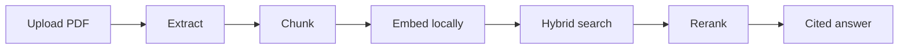

# Private PDF Q&A

> Grounded answers from a confidential PDF, with page citations, on infrastructure you control.

Upload a policy, SOP, report, or contract. Ask in plain language. Every answer cites the page it used. Documents stay on **your server**.

> **Takeaway:** This is a retrieval system, not a chatbot that guesses. If the document cannot answer, it says so.

---

## Try the pilot

🟢 **Live** · <a href="https://ai-doc-pilot.roxanatapia.dev/" target="_blank" rel="noopener noreferrer"><strong>ai-doc-pilot.roxanatapia.dev</strong></a>

- Request an invite on the gate, then upload a PDF and ask a question
- Start with the [sample NDA](docs/product/sample-nda.pdf) if you want a ready document
- Optional: [ask for a walkthrough on Upwork](https://www.upwork.com/freelancers/roxanadev)

Uploaded files are processed in memory and never stored. Each session starts fresh. Use only sample or non-confidential documents on the shared pilot.

---

## How an answer is grounded

Each step exists to keep the answer inside the PDF you uploaded.

```mermaid
flowchart LR
  A[Upload PDF] --> B[Extract]
  B --> C[Chunk]
  C --> D[Embed locally]
  D --> E[Hybrid search]
  E --> F[Rerank]
  F --> G[Cited answer]
```

| Step | Technique | Why? |
|------|-----------|------|
| **Ingest** | PyMuPDF, plus OCR on scanned pages | PDFs mix digital text and scans. Page numbers stay on the passage so a citation is checkable. |
| **Chunk** | Split at section headers | A sliding window glues neighboring clauses. Headers are the document's own boundaries. |
| **Embed** | Local sentence-transformers | Search by meaning without sending the file to an outside embedding API. |
| **Retrieve** | Hybrid search: FAISS + BM25, fused with RRF | Embeddings miss exact terms. Keyword search misses paraphrases. Fusion keeps both. |
| **Rerank** | Cross-encoder (`bge-reranker`) | First-stage ranking is approximate. Re-score question and passage together before the LLM sees them. |
| **Cite or refuse** | Page + excerpt, or "not in the document" | An answer you cannot open on a page is not grounded. No evidence means no invented clause. |

---

## What it does well

| Feature | In practice |
|---------|-------------|
| **Citations** | Page and excerpt on every answer |
| **Model choice** | Ollama writes answers on your server. Anthropic is optional when you want quicker replies. Search and citations stay the same. |
| **Private embeddings** | Vectors stay on your server |
| **Honest refusals** | Says so when the PDF does not contain the answer |
| **Document types** | Policies, SOPs, reports, contracts |

## Known limits

| Limit | In practice |
|-------|-------------|
| **Session only** | Re-upload after a restart; no shared library yet |
| **One PDF** | Not search across a file store |
| **No math** | Finds printed numbers; does not calculate |
| **Q&A only** | No CRM, email, or ticketing |

---

## Stack

PyMuPDF · FAISS · BM25 · bge-reranker · sentence-transformers · Streamlit · FastAPI · Ollama or Anthropic

MIT licensed · [Roxana Tapia](https://github.com/RoxanaTapia) · [Upwork](https://www.upwork.com/freelancers/roxanadev)
