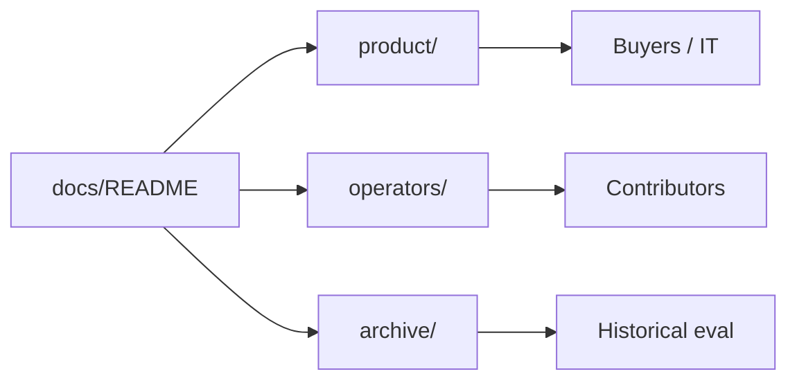

# Documentation

## Background

Start here when you want to understand the product, deploy it, or contribute. Docs are split by audience so you can skip what you do not need.

> **Takeaway:** Clients start in `product/`. Operators and contributors start in `operators/`.

---

## 📖 Where to go

| If you are… | Read first | Then |
|-------------|------------|------|
| **Evaluating the product** | [How it works](product/architecture.md) | [Demo storyboard](product/demo-script.md), [Pilot evaluation](product/pilot-evaluation.md) |
| **Deploying on a VPS** | [DEPLOYMENT.md](../DEPLOYMENT.md) | [Architecture](product/architecture.md) |
| **Browsing as a buyer** | [README](../README.md) | Live pilot + [sample NDA](product/sample-nda.pdf) |
| **Shipping milestones** | [PROJECT-DIRECTION](operators/PROJECT-DIRECTION.md) | [ROADMAP](operators/ROADMAP.md), [AGENTS.md](../AGENTS.md) |
| **Testing OCR** | [Testing OCR](operators/testing-ocr.md) | Local Docker steps |



---

## 🗂️ Folder map

```text
docs/
  README.md          ← you are here
  product/           ← how it works, demo, evaluation, sample NDA
  operators/         ← roadmap, direction, OCR testing
  archive/           ← older eval rounds (not primary reading)
```

| Folder | Role |
|--------|------|
| [`product/`](product/) | Client-readable: architecture, demo script, evaluation summary, sample NDA |
| [`operators/`](operators/) | Roadmap, project direction, contributor how-tos |
| [`archive/`](archive/) | Historical eval rounds; keep for reference, not day-one reading |


---

## 🔗 Quick links

- **Live pilot:** [ai-doc-pilot.roxanatapia.dev](https://ai-doc-pilot.roxanatapia.dev)
- **Public UI demo:** [Streamlit Cloud](https://ai-doc-to-chat-demo.streamlit.app)
- **Self-host:** [DEPLOYMENT.md](../DEPLOYMENT.md)
- **Sample upload:** [product/sample-nda.pdf](product/sample-nda.pdf)
