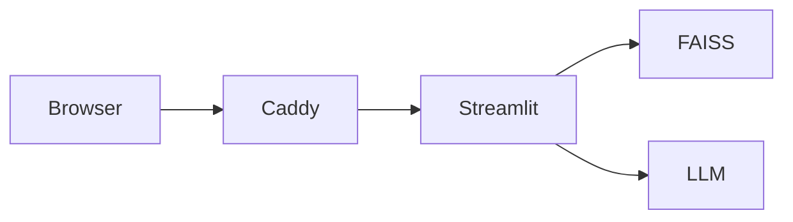
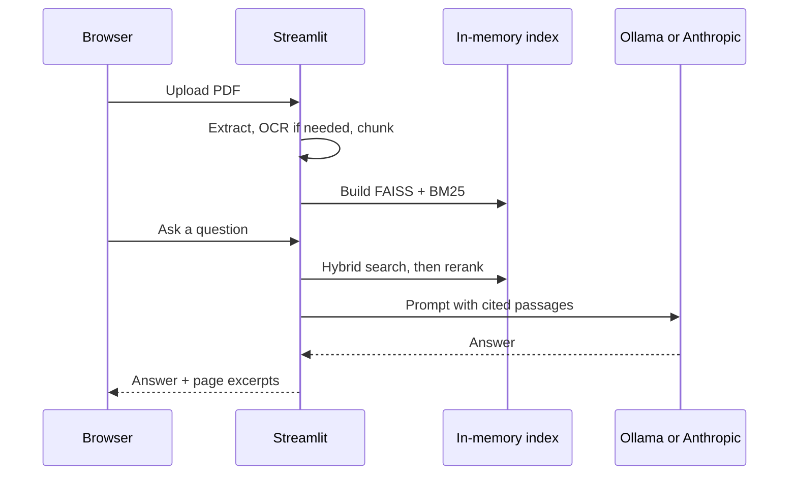
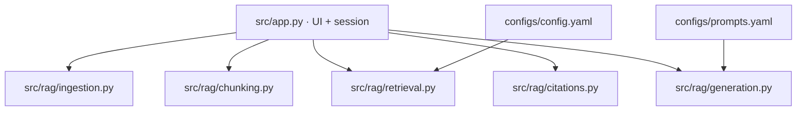

# Documentation

## Background

This page is the map of the repository. The [root README](../README.md) is the product overview. Start here when you want to know where code lives, how an answer is produced, and how work ships.

> **Takeaway:** Product code in `src/` and `configs/`. Ops in `deploy/`. Shipping in `.cursor/` and [AGENTS.md](../AGENTS.md).

---

## Where to find what

```text
.
├── README.md          Client overview and live pilot
├── AGENTS.md          How Cursor agents ship issues
├── DEPLOYMENT.md      Self-host and VPS notes
├── src/               Application code
├── configs/           Chunking, retrieval, and prompt tunables
├── tests/             pytest suite
├── deploy/            Docker, Compose (Caddy overlay for a dedicated VM)
├── .cursor/           Agent roles, rules, slash commands
└── docs/              You are here
      product/         Architecture, walkthrough, sample NDA
      operators/       Roadmap, direction, repo-structure detail
      archive/         Historical eval notes (not current)
```

| Path | Open it for |
|------|-------------|
| [`src/app.py`](../src/app.py) | Upload, chat UI, session index |
| [`src/rag/ingestion.py`](../src/rag/ingestion.py) | PDF → text + page numbers |
| [`src/rag/chunking.py`](../src/rag/chunking.py) | Header-aware chunking and section routing |
| [`src/rag/retrieval.py`](../src/rag/retrieval.py) | Hybrid search (FAISS + BM25 + RRF) and rerank |
| [`src/rag/citations.py`](../src/rag/citations.py) | Page excerpts, overlap filter, honesty guard |
| [`src/rag/generation.py`](../src/rag/generation.py) | Answer writing (Ollama or Anthropic) |
| [`src/ocr.py`](../src/ocr.py) | Scanned-page OCR |
| [`src/api/`](../src/api/) | Thin FastAPI `/health` and `/chat` |
| [`configs/config.yaml`](../configs/config.yaml) | Chunk size, hybrid weights, reranker |
| [`configs/prompts.yaml`](../configs/prompts.yaml) | Grounded-answer prompt |
| [`deploy/`](../deploy/) | Container stack. Shared portfolio Caddy: [roxanatapia-edge](https://github.com/RoxanaTapia/roxanatapia-edge) |
| [`docs/product/architecture.md`](product/architecture.md) | Single-VM deploy picture |
| [`docs/operators/REPO-STRUCTURE.md`](operators/REPO-STRUCTURE.md) | Extra layout rules |

---

## How an answer is produced

Two layers: the running services, then the Python modules that do the retrieval work.

### Runtime

The browser never talks to the index or the model directly. Caddy terminates HTTPS. Streamlit holds the session (PDF, chunks, FAISS) in memory. The LLM is either Ollama on the same VM or Anthropic when that provider is selected.


```mermaid
flowchart LR
  Browser --> Caddy
  Caddy --> Streamlit
  Streamlit --> FAISS
  Streamlit --> LLM
```


```mermaid
sequenceDiagram
  participant U as Browser
  participant S as Streamlit
  participant I as In-memory index
  participant M as Ollama or Anthropic

  U->>S: Upload PDF
  S->>S: Extract, OCR if needed, chunk
  S->>I: Build FAISS + BM25
  U->>S: Ask a question
  S->>I: Hybrid search, then rerank
  S->>M: Prompt with cited passages
  M-->>S: Answer
  S-->>U: Answer + page excerpts
```

### Code

Streamlit owns the session. Each retrieval step has its own module under `src/rag/`. Tunables come from YAML.


```mermaid
flowchart TB
  App["src/app.py · UI + session"]
  Ingest["src/rag/ingestion.py"]
  Chunk["src/rag/chunking.py"]
  Retrieve["src/rag/retrieval.py"]
  Cite["src/rag/citations.py"]
  Gen["src/rag/generation.py"]
  Cfg["configs/config.yaml"]
  Prompts["configs/prompts.yaml"]

  App --> Ingest
  App --> Chunk
  App --> Retrieve
  App --> Cite
  App --> Gen
  Cfg --> Retrieve
  Prompts --> Gen
```

| Stage | Module | Role |
|-------|--------|------|
| Ingest | `rag/ingestion.py` | Read the PDF. Keep page numbers. OCR scanned pages. |
| Chunk | `rag/chunking.py` | Split on section headers so clauses do not bleed. |
| Index | `app.py` | Embed locally. Build FAISS and BM25 for this session. |
| Retrieve | `rag/retrieval.py` | Hybrid search (FAISS + BM25, RRF), then `bge-reranker`. |
| Filter | `rag/citations.py` | Drop near-duplicates. Refuse when context is too thin. |
| Generate | `rag/generation.py` | Write the answer from the shortlist only. |
| Show | `app.py` | Page + excerpt under the reply. |

The FastAPI app in `src/api/` exposes the same generation path as `/chat`. It does not replace the Streamlit retrieval loop.

---

## How work ships

This repo includes a Cursor setup that can take a GitHub issue to a pull request without hand-wiring the steps.

| Piece | Role |
|-------|------|
| [`AGENTS.md`](../AGENTS.md) | Playbook: one issue, one branch, one PR |
| [`.cursor/agents/`](../.cursor/agents/) | Specialists (RAG, Streamlit, docs, deploy, verifier) |
| [`.cursor/commands/`](../.cursor/commands/) | `/ship-issue`, `/ship-milestone`, `/verify` |
| [`.cursor/rules/`](../.cursor/rules/) | Always-on coding and docs conventions |

Specialists edit only what they own. They do not commit. The milestone orchestrator commits, opens the PR, and can merge when checks are green. Full queue and human gates: [AGENTS.md](../AGENTS.md). Direction and sequencing: [operators/PROJECT-DIRECTION.md](operators/PROJECT-DIRECTION.md) · [operators/ROADMAP.md](operators/ROADMAP.md).

---

## Docs in this folder

If you only want the product story, these three pages are enough:

| Page | What you get |
|------|----------------|
| [Architecture](product/architecture.md) | What runs on the VM |
| [Walkthrough](product/demo-script.md) | What a live session shows, plus sample questions |
| [Sample NDA](product/sample-nda.pdf) | A ready PDF to upload |

Contributor pages (sequencing and how-tos):

| Page | What you get |
|------|----------------|
| [Roadmap](operators/ROADMAP.md) · [Project direction](operators/PROJECT-DIRECTION.md) | What ships next |
| [Repo structure](operators/REPO-STRUCTURE.md) | Layout rules that are easy to break |
| [OCR testing](operators/testing-ocr.md) | How to verify scanned PDFs |
| [Archive](archive/) | Early local-Ollama eval rounds. Historical only. |

Self-host steps stay in [DEPLOYMENT.md](../DEPLOYMENT.md). Live pilot: [ai-doc-pilot.roxanatapia.dev](https://ai-doc-pilot.roxanatapia.dev/).
