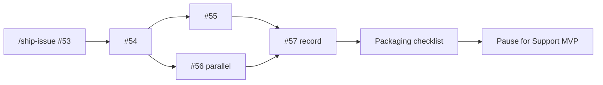

# Project direction (operator guide)

## Background

How to finish the pipeline for a freelance portfolio hero: Cursor discipline, code you understand, and a private document Q&A demo you’d show without apologizing for latency.

Full milestone detail: [ROADMAP.md](ROADMAP.md) · Agent playbook: [AGENTS.md](../../AGENTS.md) · Docs index: [docs/README.md](../README.md)

> **Takeaway:** Start Phase 1 at #53. Deep production waits for a real client.

---

## 🎯 Portfolio strategy (read first)

| Piece | Where | Role |
|-------|-------|------|
| **Hero** | **This repo** | Private RAG / document Q&A with sourced answers |
| **Sibling** | receipt-intelligence-n8n | n8n + AI document→data workflows (separate repo) |
| **Later** | Support MVP (new project) | Website chat + escalate + n8n → CRM |

This repo’s north star is **not** a website support assistant. Escalate/CRM belongs in the Support MVP later. Deep production (M9–M11) is **client-triggered**.

---

## ⭐ North star

> Upload a confidential PDF, ask a question, get a **fast** answer with **page citations** on **your** infrastructure. Optionally expose a **thin** `/health` + `/chat` API for proposals; keep eval export and persistence for when a buyer asks.

If that sentence feels true after **demo + video + packaging**, you’re hire-me ready. Thin M8 is optional (job-post driven). Then pause this repo and start the Support MVP sibling unless a paid client needs more depth here.

---

## 🧭 Three objectives

### 1. Cursor best practices (one chat per issue)

| Rule | Why |
|------|-----|
| **One GitHub issue → one Agent chat → one branch → one PR** | Clean history; you can explain each merge |
| **Orchestrator commits; specialists don’t** | You approve `commit` / `push` |
| **Use `/ship-issue #NN`** in a **new** chat per issue | Context stays small |
| **`/verify` before PR** | pytest; skip full `docker build` unless infra changed |
| **PR starts with `## Main contribution`** | Outcome for buyer/you, not file list |

**Branch names**

```text
feat/m7-8-llm-provider     → closes #53
feat/m7-8-anthropic        → closes #54
feat/m8-fastapi-chat       → closes #59
```

**When stuck:** invoke `blocker-reporter` format in AGENTS.md; update Human decisions log; STOP.

**Do not:** one mega-chat for M7.8; parallel edits on `src/rag.py` + `src/app.py` across two issues.

---

### 2. Learn the code

After each issue, you should answer **without opening Cursor**:

| Layer | Files | Question to answer |
|-------|-------|-------------------|
| **UI** | `src/app.py` | What happens on upload → index → chat? |
| **RAG** | `src/rag.py` → `src/rag/` (M8) | How does context get built before the LLM? |
| **Config** | `configs/config.yaml`, `.env` | What knob changes retrieval vs generation? |
| **Deploy** | `docker-compose*.yml`, `DEPLOYMENT.md` | How does a request reach Ollama or API LLM? |

**Per-issue learning habit (15 min after merge)**

1. Read the diff yourself.
2. Run the app locally: one upload, one question, dev sidebar on.
3. Add **one sentence** to your personal notes (`docs-private/`): what changed and why.
4. If you can’t explain it, open a **question-only** chat.

**Red flag:** merging PRs you don’t understand “to keep speed.” Slow down one issue instead.

---

### 3. Finish line (portfolio-ready hero)

| Phase | Milestones | “I’d use it / I’d show it” test |
|-------|------------|----------------------------------|
| **0** | M7 ✅ | You trust deploy; you don’t trust speed on VPS Ollama |
| **1** | M7.8 → video → packaging | You’d show a colleague the video; README looks calm |
| **2** | Thin M8 | You’d call `/chat` from curl in a proposal |
| **2b** | M8.5 (optional) | You’d send an eval report for a RAG-audit gig |
| **3** | M9–M11 | Client-triggered |
| **4** | M12 light | Short tiers/services one-pager |

---

## 📅 Phases

### Phase 0: Reference deploy ✅

**Milestones:** M7 (#33–#39)

**Shipped:** Docker, Compose, Caddy, live pilot, DEPLOYMENT, architecture, demo storyboard.

**Learnings:** Retrieval + citations are the core IP. CPU Ollama is an option, not the hero.

**Your action:** Close M7 on the board. Start Phase 1.

---

### Phase 1: Demo, video & packaging 🚧 START HERE

**Milestones:** M7.8 ([#53–#57](https://github.com/RoxanaTapia/ai-doc-to-chat-pipeline/milestone/7)) → video (#57) → packaging checklist in [ROADMAP.md](ROADMAP.md)

| # | Issue | Agent map | You learn |
|---|-------|-----------|-----------|
| 53 | LLMProvider + env switch | rag-core-engineer, config-guardian | Protocol pattern; config-driven backends |
| 54 | Anthropic adapter | rag-core-engineer, config-guardian | API keys, Haiku vs Sonnet |
| 55 | Streamlit streaming | streamlit-engineer | UX; generators |
| 56 | Docs + non-legal sample | docs-writer | Positioning; eval ≠ vertical |
| 57 | Record video + README link | docs-writer (you record) | Sales asset |



After packaging: **pause** for Support MVP. Only continue to thin M8 if FastAPI keeps showing up in jobs you want.

**Env for recording (local, never commit)**

```bash
LLM_PROVIDER=anthropic
ANTHROPIC_API_KEY=sk-...
# optional: ANTHROPIC_MODEL=claude-3-5-haiku-20241022
```

---

### Phase 2: Thin market contract (optional)

**Milestones:** M8 ([#58–#60](https://github.com/RoxanaTapia/ai-doc-to-chat-pipeline/milestone/2))

Serial #58 → #59 → #60. Only if job posts keep asking for FastAPI. Not required before Support MVP.

---

### Phase 2b: Eval export (optional / next)

**Milestone:** M8.5 ([#61](https://github.com/RoxanaTapia/ai-doc-to-chat-pipeline/issues/61))

---

### Phase 3: Production depth (client-triggered)

**Milestones:** M9, M10, M11 (issues TBD via `/ship-milestone M9`)

Not required for portfolio readiness.

---

### Phase 4: Light commercial pack

**Milestone:** M12. Short services/tiers one-pager.

---

## 📆 Weekly rhythm (part-time)

| Day | Activity |
|-----|----------|
| **Mon** | Pick one issue; move to In progress |
| **Tue–Wed** | `/ship-issue` chat; understand diff; `commit` |
| **Thu** | `/verify`; open PR; self-review |
| **Fri** | Merge; 15 min learning notes; update board |

**One issue per week** is enough for M7.8 in about 5 weeks including video.

---

## 📌 GitHub Project board

Columns: `Backlog` | `Ready` | `In progress` | `In review` | `Done`

**Ready now:** [#53](https://github.com/RoxanaTapia/ai-doc-to-chat-pipeline/issues/53)

**Do not start:** [#57](https://github.com/RoxanaTapia/ai-doc-to-chat-pipeline/issues/57) (video) until #54–#56 done.

---

## ⌨️ Commands cheat sheet

| Command | When |
|---------|------|
| `/ship-issue #53` | Implement one issue end-to-end |
| `/ship-milestone M7.8` | Plan or status for a phase |
| `/verify` | Before every PR |

---

## 🧾 Human decisions log

| Decision | Default |
|----------|---------|
| Demo / video LLM | Anthropic Haiku via `LLM_PROVIDER=anthropic` |
| Self-host / air-gap | Ollama on Compose |
| First provider in code | `LLMProvider` protocol → Ollama + Anthropic + dummy |
| OpenAI | Optional after Anthropic works |
| Pitch vertical | Confidential **documents**, not legal-only |
| Support MVP / n8n CRM bot | Separate later project |

---

## ✨ Success check (after Phase 1, + thin M8 if done)

“I built private document Q&A with cited answers. Demo uses a fast API model; clients can run local Ollama on the same Docker stack. There’s a live pilot and a walkthrough video. When needed I can expose `/health` and `/chat`. I’d deploy this for a team with sensitive PDFs.”

If that’s true, you’re ready for **first gig** conversations with proof, not promises.
