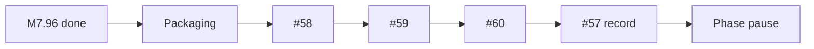

# Project direction (operator guide)

## Background

How to finish this pipeline with Cursor discipline, code you understand, and a private document Q&A demo you can show without apologizing for latency.

Full milestone detail: [ROADMAP.md](ROADMAP.md) · Agent playbook: [AGENTS.md](../../AGENTS.md) · Docs index: [docs/README.md](../README.md)

> **Takeaway:** Start thin M8 at #58 (video is last). Deep production waits for a real client.

---

## 🗺️ Milestone recap

| Milestone | Goal | Status |
|-----------|------|--------|
| **M7** | Reference deployment | ✅ Shipped |
| **M7.8–M7.96** | Demo tier, UI, Sources trust, repo clarity | ✅ Shipped |
| **Packaging** | Calm README framing (video URL later) | Soft pass |
| **M8** | Thin `/health` + `/chat` API | **Next** (#58–#60) |
| **Video (#57)** | Walkthrough linked from README | **Last** after thin M8 |
| **M8.5 / M9–M12** | Eval export; persist; SSO; ops; light pack | Optional / client-triggered |

---

## 🎯 Product scope (read first)

| Piece | Where | Role |
|-------|-------|------|
| **This product** | **This repo** | Private RAG / document Q&A with sourced answers |
| **Sibling** | receipt-intelligence-n8n | n8n + AI document→data workflows (separate repo) |
| **Later** | Support MVP (new project) | Website chat + escalate + n8n → CRM |

This repo’s north star is **not** a website support assistant. Escalate/CRM belongs in the Support MVP later. Deep production (M9–M11) is **client-triggered**.

---

## ⭐ North star

> Upload a confidential PDF, ask a question, get a **fast** answer with **page citations** on **your** infrastructure. Optionally expose a **thin** `/health` + `/chat` API for integrations; keep eval export and persistence for when a buyer asks.

If that sentence feels true after **demo + packaging + thin M8 + video**, this phase of the repo is complete. Then pause here and start the Support MVP sibling unless a paid client needs more depth.

---

## 🧭 Three objectives

### 1. Cursor best practices

| Rule | Why |
|------|-----|
| **One GitHub issue → one branch → one PR** | Clean history; each merge is explainable |
| **Orchestrator commits; specialists don’t** | Train mode: orchestrator also pushes/merges when green (see AGENTS.md) |
| **Use `/ship-issue #NN`** | Prefer one conductor chat for the delivery train; split if context grows |
| **`/verify` before PR** | pytest; skip full `docker build` unless infra changed |
| **PR starts with `## Main contribution`** | Outcome first, not a file list |

**Branch names**

```text
feat/m7-8-llm-provider     → closes #53
feat/m7-8-anthropic        → closes #54
feat/m8-fastapi-chat       → closes #59
```

**When stuck:** invoke `blocker-reporter` format in AGENTS.md; update Human decisions log; STOP.

**Do not:** one mega-PR for multiple issues; parallel edits on `src/rag/` + `src/app.py` across two issues.

---

### 2. Learn the code

After each issue, you should answer **without opening Cursor**:

| Layer | Files | Question to answer |
|-------|-------|-------------------|
| **UI** | `src/app.py` | What happens on upload → index → chat? |
| **RAG** | `src/rag/` | How does context get built before the LLM? |
| **Config** | `configs/config.yaml`, `.env` | What knob changes retrieval vs generation? |
| **Deploy** | `docker-compose*.yml`, `DEPLOYMENT.md` | How does a request reach Ollama or API LLM? |

**Per-issue learning habit (15 min after merge, optional)**

1. Read the diff yourself.
2. Run the app locally: one upload, one question, dev sidebar on.
3. Add **one sentence** to your personal notes (`docs-private/`): what changed and why.
4. If you can’t explain it, open a **question-only** chat.

**Red flag:** merging PRs you don’t understand “to keep speed.” Slow down one issue instead.

---

### 3. Finish line (demo-ready + thin API)

| Phase | Milestones | “I’d use it / I’d show it” test |
|-------|------------|----------------------------------|
| **0** | M7 ✅ | You trust deploy; you don’t trust speed on VPS Ollama |
| **1** | M7.8 → packaging | README looks calm; pilot + Cloud links clear |
| **2** | Thin M8 | You’d call `/chat` from curl in a proposal |
| **2b** | Video (#57) | You’d show a colleague the walkthrough |
| **2c** | M8.5 (optional) | You’d send an eval report for a retrieval audit |
| **3** | M9–M11 | Client-triggered |
| **4** | M12 light | Short tiers/services one-pager |

---

## 📅 Phases

### Phase 0: Reference deploy ✅

**Milestones:** M7 (#33–#39)

**Shipped:** Docker, Compose, Caddy, live pilot, DEPLOYMENT, architecture, demo storyboard.

**Learnings:** Retrieval + citations are the core IP. CPU Ollama is an option, not the walkthrough default.

**Your action:** Close M7 on the board. Start Phase 1.

---

### Phase 1: Demo & packaging ✅ (M7.8–M7.96 shipped)

**Milestones:** M7.8–M7.96 ✅ → packaging soft pass (video URL deferred) → see Phase 2.

| # | Issue | Agent map | You learn |
|---|-------|-----------|-----------|
| 53–56, 70–73, 80–83, 89–93 | M7.8–M7.96 | (shipped) | Demo tier, UI, Sources trust, repo clarity |

**M7.96 note:** left `deploy/stable` on v0.8.0; advance only when you intentionally choose to.

---

### Phase 1b: Packaging soft pass 🚧

Calm README framing, honest tiers, thumbnail story. **Do not wait** on a video URL (that is #57 after M8). Checklist: [ROADMAP.md](ROADMAP.md).

---

### Phase 2: Thin API contract 🚧 START HERE

**Milestones:** M8 ([#58–#60](https://github.com/RoxanaTapia/ai-doc-to-chat-pipeline/milestone/2))

Serial #58 → #59 → #60. Default delivery train after packaging soft pass. Does **not** wait on #57.



After thin M8 + video: **pause** for Support MVP unless a paid engagement needs more here.

---

### Phase 2b: Demo video (last)

**Issue:** [#57](https://github.com/RoxanaTapia/ai-doc-to-chat-pipeline/issues/57) — record walkthrough; link from README. Human films; agents prepare storyboard/README line.

**Env for recording (local, never commit)**

```bash
LLM_PROVIDER=anthropic
ANTHROPIC_API_KEY=sk-...
# optional: ANTHROPIC_MODEL=claude-3-5-haiku-20241022
```

---

### Phase 2c: Eval export (optional / next)

**Milestone:** M8.5 ([#61](https://github.com/RoxanaTapia/ai-doc-to-chat-pipeline/issues/61))

---

### Phase 3: Production depth (client-triggered)

**Milestones:** M9, M10, M11 (issues TBD via `/ship-milestone M9`)

Not required for the demo-ready pause.

---

### Phase 4: Light services pack

**Milestone:** M12. Short services/tiers one-pager.

---

## 📆 Weekly rhythm (part-time)

| Day | Activity |
|-----|----------|
| **Mon** | Pick one issue; move to In progress |
| **Tue–Wed** | `/ship-issue` (or continue delivery train); understand diff |
| **Thu** | `/verify`; PR; self-review |
| **Fri** | Merge (or confirm train merge); optional learning notes; update board |

**One issue per week** is enough for M7.8 in about 5 weeks including video.

---

## 📌 GitHub Project board

Columns: `Backlog` | `Ready` | `In progress` | `In review` | `Done`

**Ready now:** packaging soft pass, then [#58](https://github.com/RoxanaTapia/ai-doc-to-chat-pipeline/issues/58)

**Do not start:** [#57](https://github.com/RoxanaTapia/ai-doc-to-chat-pipeline/issues/57) (video) until thin M8 (#58–#60) is done.

---

## ⌨️ Commands cheat sheet

| Command | When |
|---------|------|
| `/ship-issue #53` | Implement one issue end-to-end |
| `/ship-milestone M7.8` | Run or plan a phase / delivery train |
| `/verify` | Before every PR |

---

## 🧾 Human decisions log

| Decision | Default |
|----------|---------|
| Demo / video LLM | Anthropic Haiku via `LLM_PROVIDER=anthropic` |
| Self-host / air-gap | Ollama on Compose |
| First provider in code | `LLMProvider` protocol → Ollama + Anthropic + dummy |
| OpenAI | Optional after Anthropic works |
| Pitch vertical | Confidential **documents**, not legal-only |
| Support MVP / n8n CRM bot | Separate later project |
| Commit / merge | Train mode in AGENTS.md (orchestrator merges when green) |
| Demo video order | **Last** after thin M8 (#57) | Not a blocker for packaging or M8 |

---

## ✨ Success check (after Phase 1 + thin M8)

“I built private document Q&A with cited answers. The demo uses a fast API model; clients can run local Ollama on the same Docker stack. There’s a live pilot and a walkthrough video. When needed I can expose `/health` and `/chat`. I’d deploy this for a team with sensitive PDFs.”

If that’s true, you’re ready for client conversations with proof, not promises.
