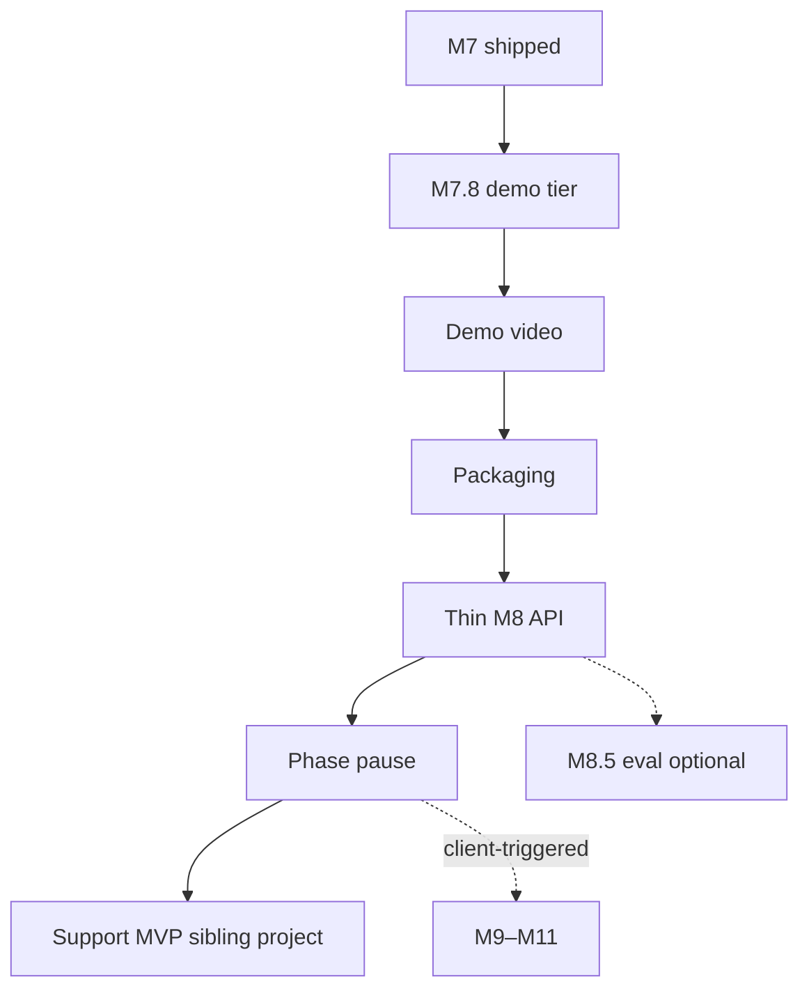

# Production roadmap

## Background

For contributors and operators. Moves the pipeline from a **reference deployment** to a **demo-ready** private document Q&A product: fast cited answers on a walkthrough, then a thin API for integrations. Deeper production work (persist / SSO / ops) is client-triggered, not the default climb after M7.

> **Takeaway:** Ship M7.8 → video → packaging → thin M8. Support MVP / n8n CRM is a separate later project.

**Positioning:** private **document Q&A** for confidential PDFs (contracts, policies, SOPs, reports, internal KB exports), not legal-only. LLM backend is swappable: local Ollama (air-gap) or Anthropic/OpenAI (speed for demos and pilots).

**Streamlit Cloud** = UI-only marketing demo (dummy generation). **Live pilot** = real RAG on your VPS. **M7.8** = demo-quality generation so the walkthrough is recordable.

---

## 🗺️ Milestone recap

| Milestone | Goal | Proof of done | Priority |
|-----------|------|---------------|----------|
| **M7** | Reference deployment | Live HTTPS pilot + `DEPLOYMENT.md` | ✅ Done |
| **M7.8** | Demo-ready tier | Swappable LLM, streaming, recordable walkthrough | **Ship next** |
| **Video (#57)** | Published walkthrough | Link in README | After M7.8 |
| **Packaging** | Calm product framing | Clear pilot + Cloud + video links | After video |
| **M8** | Thin FastAPI contract | OpenAPI `/health`, `/chat` | After packaging |
| **M8.5** | Eval harness export | Before/after retrieval report | Optional |
| **M9** | Persistent ingestion | PDFs + vectors survive restart | Client-triggered |
| **M10** | Access control | SSO / auth proxy + `SECURITY.md` | Client-triggered |
| **M11** | Ops & runbook | Backup, monitoring, `RUNBOOK.md` | Client-triggered |
| **M12** | Light services pack | Pilot tiers, `SERVICES.md` one-pager | Light |

**React UI:** optional, only if a client or RFP requires it.

---

## 🎯 Product scope

| Piece | Repo / project | Role |
|-------|----------------|------|
| **This product** | **ai-doc (this repo)** | Private RAG / document Q&A with sourced answers; pilot already live |
| **Sibling** | [receipt-intelligence-n8n](https://github.com/RoxanaTapia/receipt-intelligence-n8n) | n8n + AI workflow automation |
| **Later** | Support MVP (separate project) | Website chat + RAG + escalate + n8n → CRM |

**Out of scope for this repo’s north star**

- Do not redefine ai-doc as a “website customer support assistant.”
- Do not add escalate + n8n CRM leads as core M8+ goals here.
- Support MVP may reuse RAG patterns later; it is not the next milestone train.

---

## 🗺️ Phase map

| Phase | Milestones | Outcome you can stand behind |
|-------|------------|------------------------------|
| **0. Shipped** | M7 ✅ | Reproducible private pilot on one VM; live URL; deployment guide |
| **1. Demo & trust** | **M7.8** → video → **packaging** | Fast, cited answers on a walkthrough; calm README; clear pilot + Cloud links |
| **2. Thin API** | **M8** | Not Streamlit-only: `/health`, `/chat`, OpenAPI |
| **2b. Optional** | **M8.5** eval | Reproducible retrieval report for audits |
| **3. Client-triggered** | M9 → M11 | Docs survive restart; SSO; runbooks when a pilot/RFP needs them |
| **4. Light pack** | M12 | Pilot tiers / services one-pager |



**Phase pause** after packaging + thin M8: this repo is demo-ready and integration-ready. Then focus the Support MVP sibling unless a paid client needs more depth here. M8.5 and M9–M12 do not unlock Support MVP.

---

## M7: Reference deployment ✅ shipped

| Issue | Outcome | Status |
|-------|---------|--------|
| M7-1 | `Dockerfile` | ✅ #33 |
| M7-2 | `docker-compose.yml` | ✅ #34 |
| M7-3 | Ollama health gate | ✅ #35 |
| M7-4 | `.env.example` | ✅ #36 |
| M7-5 | `DEPLOYMENT.md` | ✅ #37 |
| M7-6 | Caddy HTTPS | ✅ #38 |
| M7-7a | Demo script + architecture | ✅ #39 |

**Live:** [ai-doc-pilot.roxanatapia.dev](https://ai-doc-pilot.roxanatapia.dev)

### Learnings (M7)

- **Deploy ≠ demo.** HTTPS + Compose proves the stack; CPU Ollama (~30–40s/answer) is too slow for a walkthrough video.
- **One issue → one PR** kept infra reviewable for technical buyers.
- **Honest limits** in README build more trust than overstated claims.

---

## M7.8: Demo-ready tier 🚧 next

**Target:** part-time · **5 issues** · `priority-ship-first`

| Issue | Outcome | GitHub |
|-------|---------|--------|
| M7.8-1 | `LLMProvider` + `LLM_PROVIDER` env (`ollama` \| `anthropic` \| `openai` \| `dummy`) | [#53](https://github.com/RoxanaTapia/ai-doc-to-chat-pipeline/issues/53) |
| M7.8-2 | Anthropic adapter (Haiku default for demo/recording) | [#54](https://github.com/RoxanaTapia/ai-doc-to-chat-pipeline/issues/54) |
| M7.8-3 | Streamlit streaming for generation | [#55](https://github.com/RoxanaTapia/ai-doc-to-chat-pipeline/issues/55) |
| M7.8-4 | Docs: broaden pitch, non-legal sample PDF, demo-script for Claude tier | [#56](https://github.com/RoxanaTapia/ai-doc-to-chat-pipeline/issues/56) |
| M7.8-5 | Record demo video + README link | [#57](https://github.com/RoxanaTapia/ai-doc-to-chat-pipeline/issues/57) |

**Definition of done:** You can record the video in one session without 40s dead air; narration honestly separates “demo tier (API)” from “self-host tier (Ollama).”

### Learnings (M7.8)

| Issue | Read / learn |
|-------|----------------|
| M7.8-1 | How `generate_answer()` in `src/rag.py` becomes a small provider protocol |
| M7.8-2 | How API keys stay in `.env`, never git; same RAG context, different backend |
| M7.8-3 | Streamlit `st.write_stream` or generator pattern |
| M7.8-4 | Product narrative ≠ code; eval corpus (NDA) ≠ market vertical |
| M7.8-5 | Walkthrough asset; no new Python required |

**Serial order:** #53 → #54 → #55; #56 parallel with #55; #57 after #54–#56.

GitHub milestone: [M7.8](https://github.com/RoxanaTapia/ai-doc-to-chat-pipeline/milestone/7)

---

## Demo video (after M7.8)

Storyboard: [`docs/product/demo-script.md`](../product/demo-script.md). Record using **Anthropic demo tier**; show architecture slide for **Ollama self-host**. Tracked as [#57](https://github.com/RoxanaTapia/ai-doc-to-chat-pipeline/issues/57).

**Where the URL goes:** after you publish, paste the public link into the **Walkthrough video** section of [`README.md`](../../README.md) (replace the TODO placeholder). That is the only required doc change to close #57.

### Learnings

- The video should show **retrieval + citations + deploy path**, not raw local inference speed.
- Pre-warm the model; run storyboard questions once before Record.

---

## Packaging (after video)

| Item | Outcome |
|------|---------|
| Thumbnail story | Calm 16:9 still (upload → cited answer) |
| README framing | Private document Q&A; pilot + Cloud links obvious |
| Video link | README Demo video line points at published walkthrough |
| Honest tiers | Demo (API LLM) vs self-host (Ollama) stated once |

**Definition of done:** A first-time reader understands the product and where to go next in under a minute.

---

## M8: Thin FastAPI contract

Thin integration surface after video + packaging. Enough for proposals and integrations. Not a large API rewrite gate.

| Issue | Outcome | GitHub |
|-------|---------|--------|
| M8-1 | Extract `src/rag/` package | [#58](https://github.com/RoxanaTapia/ai-doc-to-chat-pipeline/issues/58) |
| M8-2 | FastAPI `/health`, `/chat`, OpenAPI at `/docs` | [#59](https://github.com/RoxanaTapia/ai-doc-to-chat-pipeline/issues/59) |
| M8-3 | Streamlit calls API when `API_BASE_URL` set (optional) | [#60](https://github.com/RoxanaTapia/ai-doc-to-chat-pipeline/issues/60) |

**Definition of done:** `curl /health` and `/chat` work; Streamlit still runs standalone.

**Serial:** #58 before #59–#60.

GitHub milestone: [M8](https://github.com/RoxanaTapia/ai-doc-to-chat-pipeline/milestone/2)

---

## M8.5: Eval harness export (optional / next)

| Issue | Outcome | GitHub |
|-------|---------|--------|
| M8.5-1 | CLI/script: fixed Q-set → JSON/Markdown report | [#61](https://github.com/RoxanaTapia/ai-doc-to-chat-pipeline/issues/61) |

**Definition of done:** One command reproduces [`pilot-evaluation.md`](../product/pilot-evaluation.md)-style output for any doc in corpus.

---

## M9: Persistent ingestion (client-triggered)

- Postgres + pgvector (+ optional MinIO)
- Ingest: upload → chunk → store; retrieval from DB
- Backup/restore documented

**Definition of done:** Reboot server → documents still searchable.

**When:** A pilot or RFP needs persistence.

---

## M10: Access control (client-triggered)

- SSO or auth proxy; `docs/SECURITY.md`; optional API key for `/chat`

**When:** Enterprise login is in scope for a paid engagement.

---

## M11: Ops & runbook (client-triggered)

- `RUNBOOK.md`, monitoring, backups, structured logging

**When:** Client IT asks how to operate after pilot yes.

---

## M12: Light services pack

- Short `docs/SERVICES.md` / pilot tiers one-pager
- Video link maintained in README
- OpenAI docs only if that SKU is offered

**Note:** Anthropic implementation lives in **M7.8**; M12 is light offers and docs.

---

## ✅ Engagement readiness

| Stage | You can confidently offer |
|-------|---------------------------|
| **Now (M7)** | RAG retrieval review; private pilot deploy; live URL |
| **After M7.8 + video + packaging** | Walkthrough with cited answers; clear demo vs self-host story |
| **After thin M8** | Integrations via `/health` + `/chat` / OpenAPI |
| **After M8.5** | Reproducible retrieval reports for audits |
| **After M9–M11 (client-scoped)** | Deeper production contracts |

---

## 🏛️ Architecture target

```text
Browser → HTTPS (Caddy) → Streamlit and/or FastAPI
                              │
                              ├── Postgres + pgvector (M9, when client needs)
                              ├── MinIO (PDFs, optional)
                              └── LLM (Ollama | Anthropic | OpenAI)
```

**Today:** M7 shipped (Streamlit + Ollama + FAISS per session). **Next:** M7.8 swappable LLM + streaming → video → packaging → thin M8.

Client-readable diagram: [product/architecture.md](../product/architecture.md).

---

## 🛠️ Cursor workflow

| Resource | Location |
|----------|----------|
| Operator guide | [PROJECT-DIRECTION.md](PROJECT-DIRECTION.md) |
| Docs index | [docs/README.md](../README.md) |
| Orchestration | [AGENTS.md](../../AGENTS.md) |
| Commands | `/ship-issue`, `/ship-milestone`, `/verify` |
| Rules | `.cursor/rules/milestone-workflow.mdc` |

**Loop (train mode):** pick GitHub issue → conductor chat → `/ship-issue #NN` → verifier → orchestrator commit/PR/merge → status pulse → next issue. See [AGENTS.md](../../AGENTS.md).

Issue map: M7.8 [#53–#57](https://github.com/RoxanaTapia/ai-doc-to-chat-pipeline/milestone/7) · M8 [#58–#60](https://github.com/RoxanaTapia/ai-doc-to-chat-pipeline/milestone/2) · M8.5 [#61](https://github.com/RoxanaTapia/ai-doc-to-chat-pipeline/milestone/2)
