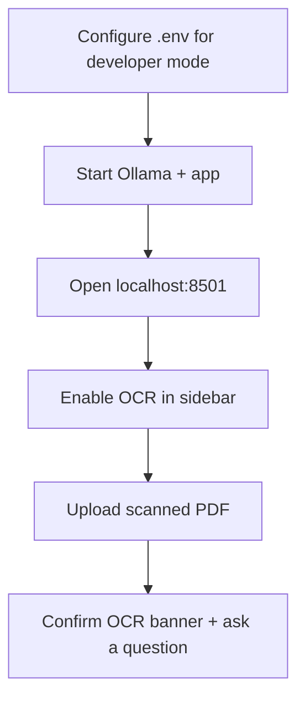

# Testing OCR

## Background

For contributors verifying scanned-PDF support. Two levels: fast unit tests (no Tesseract binary) and an integration check on the local Docker stack.

> **Takeaway:** Unit tests run anywhere. Integration needs a truly image-based PDF; the sample NDA will not trigger OCR.

---

## 🧪 Unit tests (no Tesseract needed)

All external OCR dependencies are mocked. Coverage targets `src/ocr.py`.

```bash
python3 -m venv .venv
source .venv/bin/activate
pip install pytest pillow

pytest tests/test_ocr.py -v
```

Expected: **13 passed**.

| Test | What it checks |
|------|----------------|
| `test_empty_string_is_scanned` | Empty text → scanned-page detection returns `True` |
| `test_text_at_boundary_is_not_scanned` | 50+ chars → not treated as scanned |
| `test_returns_stripped_text_and_no_error_on_success` | Happy path returns `(text, None)` |
| `test_returns_error_message_when_pytesseract_import_fails` | Missing dep → friendly error |
| `test_returns_error_message_on_runtime_error` | Missing Tesseract binary → friendly error |
| `test_returns_error_message_on_os_error` | Corrupt pixmap → graceful error |
| `test_returns_error_message_on_value_error` | Unsupported image mode → graceful error |

---

## 🐳 Integration test (local Docker + scanned PDF)

### Prerequisites

- Docker and Docker Compose
- Tesseract already in the image (`tesseract-ocr` in `deploy/Dockerfile`)
- A **genuinely scanned PDF** (image pages, no selectable text)

### Create a scanned test PDF

On iPhone: photograph a printed page → Files → **Create PDF** → AirDrop to Mac.

On Mac: open an image in Preview → **File → Export as PDF**.

Do **not** use [`product/sample-nda.pdf`](../product/sample-nda.pdf). It is a digital PDF with extractable text, so OCR will not run.

### Steps



1. **Configure `.env` for developer mode** so the OCR diagnostics sidebar is visible:

   ```bash
   cp .env.example .env
   # Add:
   APP_ALLOW_DEV_TOGGLE=true
   APP_PRESENTATION_MODE=developer
   USE_DUMMY_GENERATOR=false
   ```

2. **Start the local stack** (no Caddy needed):

   ```bash
   docker compose -f deploy/docker-compose.yml up -d ollama
   docker compose -f deploy/docker-compose.yml ps ollama   # wait for STATUS = healthy (~60 s)
   docker compose -f deploy/docker-compose.yml exec ollama ollama pull phi3:mini
   docker compose -f deploy/docker-compose.yml up --build -d app
   ```

3. Open [http://localhost:8501](http://localhost:8501).

4. Enable developer mode in the sidebar.

5. Confirm OCR is on: Advanced Options → “Enable OCR”.

6. Upload your scanned PDF.

7. Check for OCR indicators:
   - Orange warning: `"OCR used on N page(s)…"`
   - Developer caption with scanned / applied / unresolved counts

8. Ask a question about content on the scanned page.

### Passing look

```text
Scanned PDF uploaded and indexed without crash
OCR warning banner appears
Developer diagnostics show scanned_pages_detected > 0, OCR applied > 0
Answer cites the correct page
```

### Failure modes

| Symptom | Cause | Fix |
|---------|-------|-----|
| No OCR warning, no answer | PDF has selectable text | Use a true image-based PDF |
| `"OCR dependencies not installed"` | Missing Python OCR deps in image | `docker compose -f deploy/docker-compose.yml build --no-cache app` |
| `"OCR failed on page: …"` | Tesseract binary absent | Check `deploy/Dockerfile` installs `tesseract-ocr` |
| Answer is gibberish | Low scan quality | Cleaner scan; OCR depends on DPI and contrast |

---

## ☁️ Streamlit Cloud

Streamlit Cloud does not allow custom system packages like the `tesseract` binary. The app catches the missing dependency and shows a user-facing warning. OCR is available only in the Docker stack (local or VPS).
