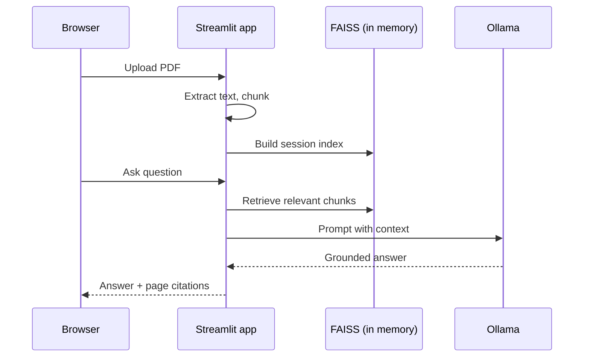

# Architecture: single-VM pilot

## Background

For technical buyers and IT reviewers who want to see how the stack fits on one machine. Matches the Compose files in this repo (`docker-compose.yml` plus optional `docker-compose.caddy.yml` for HTTPS).

> **Takeaway:** Browser traffic hits Caddy; Streamlit and Ollama stay internal. Documents live in memory for the session; only model weights persist on disk.

---

## 🏗️ Stack overview

```text
                    Internet (HTTPS :443, HTTP :80)
                                │
                                ▼
                    ┌───────────────────────┐
                    │  Caddy                │
                    │  TLS + basic auth     │
                    └───────────┬───────────┘
                                │ reverse_proxy → app:8501
                                ▼
                    ┌───────────────────────┐
                    │  Streamlit app        │
                    │  PDF → chunk → FAISS  │
                    │  (in-process / RAM)   │
                    └───────────┬───────────┘
                                │ OLLAMA_HOST
                                ▼
                    ┌───────────────────────┐
                    │  Ollama               │
                    │  volume: ollama_models│
                    └───────────────────────┘
```

With the Caddy overlay active, Streamlit and Ollama are **not** published to the host. Only ports `80` and `443` are exposed.

---

## 🧩 Services

| Service | Image / build | Published ports | Role |
|---------|---------------|-----------------|------|
| `caddy` | `caddy:2.9.1-alpine` | `80`, `443` | TLS, basic auth, reverse proxy |
| `app` | Dockerfile (this repo) | *(none with Caddy)* | UI, RAG, local embeddings |
| `ollama` | `ollama/ollama:0.6.5` | *(internal)* | Local LLM; models on `ollama_models` |

**Pilot start (HTTPS):**

```bash
docker compose -f docker-compose.yml -f docker-compose.caddy.yml up -d
```

For local work without HTTPS, use `docker-compose.yml` alone. Then `app` binds `8501` on the host.

Full steps: [DEPLOYMENT.md](../../DEPLOYMENT.md).

---

## 🔄 Data flow (one question)



1. Upload PDF → PyMuPDF (optional OCR) → text chunks → in-memory FAISS index.
2. Ask a question → retrieval → context with page metadata.
3. App calls Ollama on the Compose network → answer and source excerpts in the UI.

Documents and vectors live in the app process for the session. Only Ollama model weights persist (`ollama_models` volume).

---

## 🌱 What comes later

Production rollouts often add persistent document storage, a thin REST API for integrations, and enterprise login, while keeping the same retrieval and generation core. Local Ollama stays the default for air-gapped or private hosts; a cloud LLM can be used for faster demos when procurement allows it.

See [operators/ROADMAP.md](../operators/ROADMAP.md) for the phased plan.

---

## ⚙️ Environment (pilot)

| Variable | Purpose |
|----------|---------|
| `OLLAMA_HOST` | Ollama URL (e.g. `http://ollama:11434` in Compose) |
| `USE_DUMMY_GENERATOR` | `false` for real generation |
| `OLLAMA_MODEL` | Model tag (e.g. `phi3:mini` on CPU hosts) |
| `SITE_ADDRESS` / `ACME_EMAIL` | Domain and email for Let's Encrypt |

Full operator notes: [DEPLOYMENT.md](../../DEPLOYMENT.md#environment-variables).
