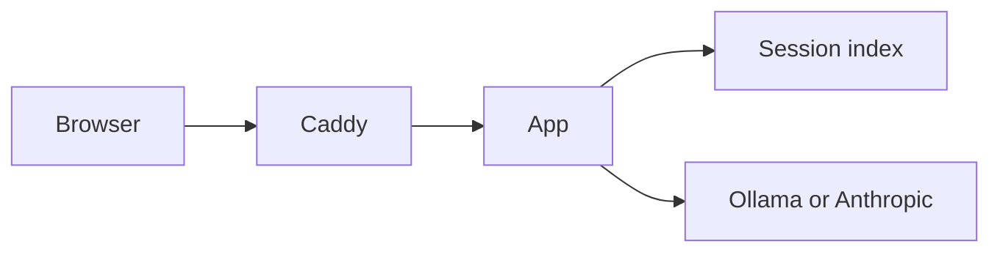
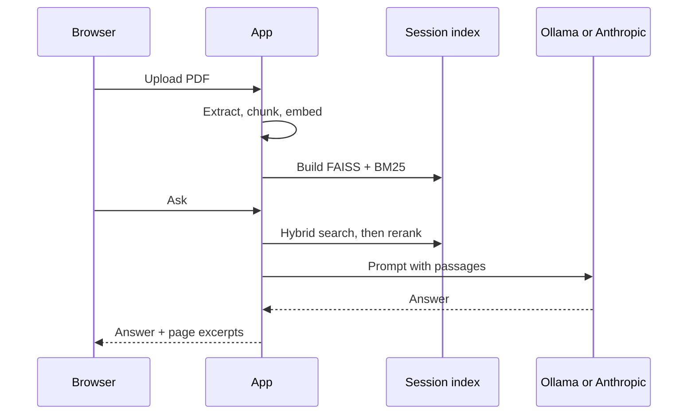

# Architecture

## Background

How the live pilot runs on one machine. For the retrieval steps and module map, see [docs/README.md](../README.md). For install steps, see [DEPLOYMENT.md](../../DEPLOYMENT.md).

> **Takeaway:** HTTPS at the edge. The app and the local model stay inside the VM. The PDF lives in memory for the session.

---

## What runs where

```mermaid
flowchart LR
  Browser --> Caddy
  Caddy --> App
  App --> Index[Session index]
  App --> LLM[Ollama or Anthropic]
```

| Piece | Role |
|-------|------|
| **Caddy** | HTTPS and the invite gate. Only ports 80 and 443 face the internet. On the portfolio VPS this process runs in [roxanatapia-edge](https://github.com/RoxanaTapia/roxanatapia-edge). |
| **App** | Streamlit UI plus retrieval. The PDF, chunks, and FAISS index stay in RAM. |
| **Ollama** | Local model on the same VM, when that provider is selected. |
| **Anthropic** | Optional. Quicker answers; retrieved passages leave the VM for generation. |

Embeddings always run on the server. Switching the writer (Ollama vs Anthropic) does not change search or citations.

---

## One question

```mermaid
sequenceDiagram
  participant U as Browser
  participant A as App
  participant I as Session index
  participant M as Ollama or Anthropic

  U->>A: Upload PDF
  A->>A: Extract, chunk, embed
  A->>I: Build FAISS + BM25
  U->>A: Ask
  A->>I: Hybrid search, then rerank
  A->>M: Prompt with passages
  M-->>A: Answer
  A-->>U: Answer + page excerpts
```

Nothing is written to a document library. Restart the app and you upload again. Model weights on disk are the only durable data (Ollama volume).

---

## What this pilot does not include yet

A shared library, SSO, and multi-project tenancy. Those wait for a real engagement. The retrieval core stays the same when they land.
