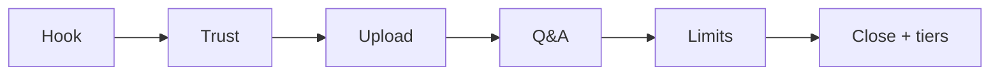

# Demo video: 5-minute storyboard

## Background

Public outline for a short walkthrough of the live pilot. A fuller recording script (pre-flight checks, operator notes, extended Q&A) lives in local **`docs-private/demo-script.md`** (gitignored, not in this repo).

> **Takeaway:** Show privacy, upload, cited answers, and honest limits. Record on the Anthropic demo tier for pace; close with the Ollama self-host architecture so buyers know both paths.

---

## 🎯 Audience

A technical buyer or evaluator who saw the [public Streamlit demo](https://ai-doc-to-chat-demo.streamlit.app) and wants proof of grounded answers on infrastructure you control. Pitch is **confidential document Q&A** (policies, SOPs, reports, contracts), not a legal-only tool and not a website support chatbot.

---

## ✅ Before you record

- Live pilot reachable at your password-protected URL ([DEPLOYMENT.md](../../DEPLOYMENT.md))
- **Demo tier for recording:** `LLM_PROVIDER=anthropic` with `ANTHROPIC_API_KEY` in `.env` only (never on camera or in git). Prefer Haiku for snappy answers. See [Anthropic demo tier](../../DEPLOYMENT.md#anthropic-demo-tier).
- Sample PDF ready: [sample NDA](sample-nda.pdf) and/or export [sample retention policy](sample-policy.md) to PDF
- Model warm (one throwaway question after login)
- Browser window about 1280×720; hide bookmarks and unrelated tabs
- Architecture slide or tab ready: [architecture.md](architecture.md) for the Ollama self-host close

> **Two tiers.** Demo tier (Anthropic) is for smooth recording and low latency. Self-host tier (Compose + Ollama) is for private / air-gap evaluation. Say both on camera; do not imply the video latency is what CPU Ollama always feels like.

---

## 🎬 Storyboard (~5 min)

| Time | Scene | Show | Say (gist) |
|------|-------|------|------------|
| 0:00–0:30 | Hook | Public demo dummy banner → live pilot login | “The free demo is UI-only. Here is the same app with a real model on a private VM.” |
| 0:30–1:00 | Trust | HTTPS lock, basic-auth login, privacy note | “Documents stay in memory for the session. Nothing is stored on the shared pilot.” |
| 1:00–2:00 | Upload | Upload sample NDA or retention policy; expand extracted text | “Upload a PDF. Policies, SOPs, reports, contracts. The app extracts text, chunks it, and builds a searchable index in-process.” |
| 2:00–3:30 | Q&A | Two or three grounded questions with sources | Ask about retention, parties, or a clause; point to page citations. Fast answers because this recording uses the Anthropic demo tier. |
| 3:30–4:20 | Limits | One question the model should refuse or hedge | Show “not in document” or session scope. Contrast with generic chatbots that invent answers. |
| 4:20–5:00 | Close + tiers | [Architecture](architecture.md) (Ollama box) + [DEPLOYMENT](../../DEPLOYMENT.md) | “What you saw used a fast demo-tier LLM for recording. For air-gap and full privacy, the same Compose stack runs Ollama on your VPS. Next step is evaluation on your documents.” |

---

## 💬 Sample questions

### Sample NDA

Use questions that match numbered sections so citations are obvious:

1. Who are the parties to this agreement?
2. What is the term or duration?
3. What obligations apply to confidentiality?

### Sample retention policy

1. How long are customer contracts retained after the relationship ends?
2. What happens to project working notes after a project closes?
3. What rule applies when Legal issues a litigation hold?

Expected answer quality: [Pilot evaluation](pilot-evaluation.md).

---

## 🗺️ Two-tier LLM story (say this once, clearly)

| Tier | When | Backend |
|------|------|---------|
| **Demo** | Walkthrough video, snappy pilot demos | `LLM_PROVIDER=anthropic` (Haiku default) |
| **Self-host** | Private eval, air-gap, documents must not leave your network | Compose + Ollama (`phi3:mini` on CPU, larger models if you have RAM/GPU) |

Embeddings stay local either way. Switching tiers is an env change, not a rewrite. Details: [DEPLOYMENT.md](../../DEPLOYMENT.md).

---

## 📤 After recording

When the walkthrough is published (Loom, YouTube unlisted, etc.), add the URL to the **Demo video** line in [README.md](../../README.md). No other code change is required until the link exists.
