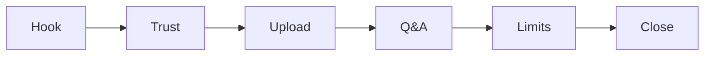

# Demo video: 5-minute storyboard

## Background

Public outline for a short walkthrough of the live pilot. A fuller recording script (pre-flight checks, operator notes, extended Q&A) lives in local **`docs-private/demo-script.md`** (gitignored, not in this repo).

> **Takeaway:** Show privacy, upload, cited answers, and honest limits. Deploy proof and demo speed are different stories; say so on camera.

---

## 🎯 Audience

A technical buyer or evaluator who saw the [public Streamlit demo](https://ai-doc-to-chat-demo.streamlit.app) and wants proof of grounded answers on infrastructure you control.

---

## ✅ Before you record

- Live pilot reachable at your password-protected URL ([DEPLOYMENT.md](../../DEPLOYMENT.md))
- [Sample NDA](sample-nda.pdf) ready to upload
- Model warm (one throwaway question after login)
- Browser window about 1280×720; hide bookmarks and unrelated tabs

> **Deploy ≠ demo.** CPU Ollama on a small VPS can take tens of seconds per answer. For a polished video, use a fast demo-tier model when that option is available, and still show the self-host path in the close.

---

## 🎬 Storyboard (~5 min)

| Time | Scene | Show | Say (gist) |
|------|-------|------|------------|
| 0:00–0:30 | Hook | Public demo dummy banner → live pilot login | “The free demo is UI-only. Here is the same app with a real model on a private VM.” |
| 0:30–1:00 | Trust | HTTPS lock, basic-auth login, privacy note | “Documents stay in memory for the session. Nothing is stored on the shared pilot.” |
| 1:00–2:00 | Upload | Upload sample NDA; expand extracted text | “Upload a PDF. The app extracts text, chunks it, and builds a searchable index in-process.” |
| 2:00–3:30 | Q&A | Two or three grounded questions with sources | Ask about parties, term, or a clause; point to page citations. |
| 3:30–4:30 | Limits | One question the model should refuse or hedge | Show “not in document” or session scope. Contrast with generic chatbots. |
| 4:30–5:00 | Close | [Architecture](architecture.md) or deployment guide | “Same Compose stack deploys on your VPS. Next step is evaluation on your documents.” |

---

## 💬 Sample questions (sample NDA)

Use questions that match numbered sections so citations are obvious:

1. Who are the parties to this agreement?
2. What is the term or duration?
3. What obligations apply to confidentiality?

Expected answer quality: [Pilot evaluation](pilot-evaluation.md).

---

## 📤 After recording

When the walkthrough is published (Loom, YouTube unlisted, etc.), add the URL to the **Demo video** line in [README.md](../../README.md). No other code change is required until the link exists.
