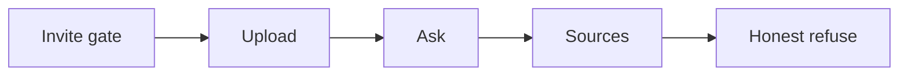

# Walkthrough

## Background

What a short session on the [live pilot](https://ai-doc-pilot.roxanatapia.dev/) should show. Request an invite on the gate; no approval is required.

> **Takeaway:** Upload, ask, open the page citation, then ask something the PDF cannot answer.

---

## What you will see

```mermaid
flowchart LR
  Gate[Invite gate] --> Upload
  Upload --> Ask
  Ask --> Sources
  Sources --> Refuse[Honest refuse]
```

1. **Gate.** Request an invite, then open the app.
2. **Upload.** Use the [sample NDA](sample-nda.pdf), or export the [sample policy](sample-policy.md) to PDF. Do not upload real company files on the shared pilot.
3. **Ask.** A question the document can answer. **Sources** opens under the answer — check that the page matches the clause.
4. **Refuse.** A question the document does not answer. The app should say so, not invent a clause.

Uploaded files stay in memory for the session. Each visit starts fresh.

---

## Sample questions

### Sample NDA

1. What's confidential information? (or: How is Confidential Information defined in Section 1?)
2. What obligations does Section 3 impose on the Receiving Party?
3. Does this agreement specify liquidated damages? (It does not.)

Sources for question 1 should stay on the definition clause (page 1), not neighboring duties or oral-disclosure text.

### Sample retention policy

1. How long are customer contracts retained after the relationship ends?
2. What happens to project working notes after a project closes?
3. What rule applies when Legal issues a litigation hold?

---

## Where the answer is written

| Choice | When |
|--------|------|
| **Ollama** | Answers stay on your server. |
| **Anthropic** | Optional, when you want quicker replies. |

Search and citations stay on the server either way. How the pieces connect: [docs/README.md](../README.md).
